# Clase 1 - Introducción

## ¿Por qué este ramo?

Aumenta la **comlejidad** del software actual.

Existe conocimiento de arquitecturas de **referencia**, **frameworks** y **patrones** para usar como base y mejorar la calidad de diseño.

Garantizar **calidad**, reducir costos y permitir **felxibilidad**

## Motivación

Típicamente los sistemas de desarrollo atienden intereses puntuales
* Lista de requisitos/requerimientos
* Modelo de dominio
* Desarrollo de software

Aparecen cambios 
* Modificaciones
* Adaprtaciones
* Extensiones
* Parches
* ...

Esto hace que se quede software inutuilizado, repetido o que se generen muchas dependencias y no siempre funcionan correctamente

## Problemas de la Ingeniería de Software

### Accidentales

* Existe una solución... hay que encontrar una solución "elegante"
* Mejora de productividad
    * Programación y abstracciones: lenguajes de programación de alto nivel
    * Resultados de las decisiones de programación toma mucho tiempo
    * Programas heterogéneos
        * IDEs
        *Apoyo al desarrollo

### Esenciales

* Solo existen soluciones parciales
    * Complejidad
        * Crece de manera no lineal
    * Conformidad
        * Sistema operativo, hardware, ...
    * Cambiabilidad (adaptabilidad)
        * Nuevas aplicaciones, usuarios, náquibas, estándares, leyes, hardware, ...
    * Intangibilidad
        * No hay leyes físicas, no hay una percepción obvia

## Arquitectura de Software

Conjunto de las **principales** decisiones de diseño sobre el sistema
* Estructura
* Conducta
* Iteración
* Propiedades no funcionales

Son decisiones que afectan *todo el sistema*

No se especifican detalles -de implementación- pero si los componentes que cargan con la responsabilidad de la implementación
    * Componentes de grano grande y subsistemas, no clases ni algoritmos

Va del análisis a la implementación

El objetivo es manejar la complejidad y cumplir con los *atributos de calidad*

Tomar decisiones que afectan a todo el sistema

Considera:
* Elementos -> qué
* Forma -> cómo
* Logica -> por qué

Involucra:
* Elementos a partir de los cuales se constuye un sistema
* Interacciones entre los elementos
* Patrones que guían su composición
* Restricciones sobre esos patrones
* Abstracciones, de-composición, compocisión, estilo y esética

"La organización fundamental de un sistema se ve reflejada en sus componentes, relaciones enrtre ellos y el ambiente y los principios que gobiernan su deiseno y evolución" (Recommended Practice for Architectural Description of Software-Intensive Systems ANSI/IEEE Std 1471-2000)

Captura la *estructura* del sistema en términos de componentes y cómo interactúan

Define las reglas de diseño y evolución globales al sistema

Componentes, módulos, objetos o cualquier otra unidad de software interrelacionada

## Principios

* **Cohesión**
* **Acomplamiento**
* Consistencia
* YAGNI (you aren't going to need it)
* KISS (keep it simple and stupid)
* Calidad
* Testing
* Diseño (frameworks, patrones, etc)
* ...

### Cohesión

La funcionalidad relacionada debe ir junta, dentro de un módulo

Las partes dentro de un módulo deben trabajar juntas

### Acomplamiento

Interdependencia entre módulos

### Capas de abstracción

## Roles del arquitecto

* Juntar requisitos
* Documentar
* Diseñar
* Comunicar
* Liderar el desarrollo

Las mejores arquitecturas son producto de
* Solo una mente
* Un equipo pequeño y estrtucturado (Rechtin, Systems Architecting: Creating & Building Complex Systems, 1991, p21)

Todo proyecto debe tener exactamente un arquitecto identificable (un responsable)
* Para proyectos más grandes, el arquitecto principal debe/puede estar respaldado por un arquitecto o subequipo

### Habilidades esperadas

* Capacidad de desarrollo de software (experto)
* Expertiz en el dominio (experto en el tema)
* Comunicador
* Estratega
* Consultor
* Líder
* Tecnólogo
* Estimador de costo
* Animador/ motivador
* Político
* Vendedor

### Arquitecto como desarrollador

Debe entender las dificultades del desarrollo de software
* Principios
* Métodos y técnicas
* Metodologías
* Herramientas

Debe entender las ramificaciones de las decisiones arquitectónicas
* No debe viivir en una "torre de marfil"
* Restricciones (de implementación) de sus decisiones

### Arquitecto como experto del tema

No basta con que sea un buen programadro

Problemas con el dominio del tema
* Madurez
* Estabilidad
* Usuarios y sistemas

Puede afectar de fran manera a la arquitectura diseñada y la implementación de la solución
* Capacidad de escalar
* Capacidad de evolución
* ...

Requiere de artefactos para entender el problema
* No la solución

### Arquitecto como estratega

Desarrollar una arquitectura "elegante" no es suficiente
* La tecnología es solo una parte de la solución
* La arquitectura debe ser adecuada para la organización

Debe ajustarse a la organización
* Estrategia de negocios
* A las prácticas del negocio
* A los ciclos de planificación
* Debe ajustarse (o funcionar bien) con los procesos del negocio

Debe estar consciente de la competencia
* Productos
* Estrategias
* Procesos

### Arquitecto como comunicador

Es casi la mitad del trabajo

Debe
* Escuchar las preocupaciones de los Stakeholders
* Explicar la arquitectura de la solución
* Negociar compromisos y fechas

Necesita las capacidades para
* Escribir bien
* Hablar (convencer)
* Presentar

### Arquitecto como líder

Debe ser un líder técnico
* En base a su conocimiento y sus logros
* Inspira respeto a través de sius ideales, epertiz, palabras y acciones
* No puede apoyarse solo en su disposición en el organigrama

Asegurar que se sigan las reglas, guías y decisiones de diseño

Mejorar la productividad y calidad al agregar/incorporar
    * Nuevas ideas, soluciones y técnicas
    * Mentores y nuevas personas al proyecto

Tomar decisiones y ayudar en asegurar la implementación

### Arquitecto como tecnólogo

Entender los enfoques de desarrollo
* Basado en objetos y componentes

Entender las tecnologías fundamentales
* Redes y sistemas operativos
* Middleware
* Seguridad
* Bases de datos
* Interfaces gráficas (GUI)

Estar al día con las corrientes

Demostrar expertiz en
* Modelar el sistema
* Análisis de trade-off de la arquitectura
* Amarrar requerimientos de sistema a la solución arquitectónica

### Arquitecto como estimador de costos

Entender las ramificaciones financieras de las decisiones arquitectónicas
* Green field vs Brown field
* Costo de adoptar COTS
* Costo de desarrollar para el reuso
* Estabilidad financiera y posición de la compañia en el rubro

La solución tecnológica superior no siempre es la más apropiada
* Impacto en el costo y en el cronograma

Aproximaciones de estimaciones de costos son suficientes (en general)
* Se puede entrar en mayor detalle cuando las opciones se han reducido a un pequeño grupo

### Arquitecto como vendedor

Por las razones anteriores, el arquitecto debe vender:
* La visión general
* La solución tecnológica
* Principales propiedades arquitectónicas
* Principales propiedades del sistema que se obtendrá
* Perfil de costos y cronogramas
* Importancia de apegarse a la arquitectura

## Rol del equipo de arquitectura

Definit la arquitectura de software

Mantener la integridad de la arquitectura de software

Explorar y mitigar los riesgos asociados al diseño

Propones orden y contenidos de las iteraciones

Coordinar y co-existir con otros equipos

Asistir en las decisiones del proyecto

Asistir en las definiciones del proyecto

# Clase 2 - Requisitos no funcionales (NFR)

## Diseño de la arquitectura de software

1. Identificar **requisitos no funcionales** (atributos de calidad) y restricciones
2. Diseñar y/o elegir un framework/metáfora/estilo
3. Validar
4. Documentar decisiones de diseño

## NFP: non functional properties

Las propiedades no funcionales (atributos de calidad) son el resultado de las decisiones de arquitectura

Los requisitos no funcionales, son los "valores" que se esperan de dichas propiedades

Atributos ejemplo:

| Atributo de calidad | Requisito arquitectónico |
|---------------------|--------------------------|
| Desempeño | La aplicación debe entregar tiempos de respuesta menores a 4 segundos para el 90% de las solicitudes |
| Seguridad | Toda comunicación debe ser autenticada y encriptada usando certificados |
| Gestión de recursos | El servidor debe correr como un proceso no prioritario en un PC con 512MB de memoria |
| Usabilidad | La interfaz de usuario debe correr en un browser de Internet para los usuarios remotos |
| Disponibilidad | El sistema debe correr 24x7x365, con una disponibilidad promedio de 0.99 |
| Confiabilidad | No se acepta pérdidad de mensajes, el resultado de la entrefa de mensajes debe conocerse en 30 segundos |
| Escalabilidad | La aplicación debe manejar na carga *peak* de 500 usuarios concurrentes durante el periodo de inscripción |
| Flexibilidad | La arquitectura debe permitir una migración en fases del lenguajr 4GL a .NET |

Restricciones ejemplo:

| Restricción | Requisito arquitectónico |
|-------------|--------------------------|
| Negocio | La aplicación debe correr como un plugin para MS Biz Talk |
|| Queremos aliarnos (y obtener fondos) de Xcorp |
| Deasarrollo | El sistema debe estar escrito en Java |
| Tiempo | La primera versión debe entregarse en 6 meses |

## Atributos de calidad

### Performance - Desempeño

Carga del trabajo que una aplicación debe ejecutar en una unidad de tiempo y/o deadlines que debe cumplir para una correcta operación

* Throughput - salida: carga de trabajo en una unidad de tiempo (transacciones por segundo - tps). Peak y promedio
* Tiempo de respuesta: latencia que una aplicación exhibe al procesar una carga de trabajo. Garantizado (límite) y promedio
* Deadline - plazo: ventana de tiempo para la comleción de una carga de trabajo

### Escalabilidad

¿Qué tan bien trabaja una solución cuando el tamaño del problema aumenta?

* Request - cantidad de solicitudes: multi thread, balance de carga (repartir las solicitudes entre varios sevidores/CPUs)
* Cantidad de conexiones concurrentes
* Tamaño de datos: cantidad de datos que puede procesar la aplicación en cada transacción (incremento en el tamaño de los paquetes de datos)
* Deployment - implantación: cantidad de esfuerzo requerido en distribuir, actualizar, configurar una aplicación (incremento en cantidad de usuarios)

### Integración 

Esfuerzo requerido para integrar una aplicación en un contexto mayot

* A nivel de datos (DB accesible a otras aplicaciones)
    * Flexible, simple y peligrosa
* API (Application Programming Interface) 
    * Conjunto de funciones (parametrizadas) que controlan el acceso a los datos. Garantizan integridad de datos y reglas de negocio
    * Compleja, costosa y segura

### Flexibilidad

Esfuerzo requerido para cambiar una aplicación (modificar funcinalidad o arquitectura)

* Requiere identificar esxenarios de cambios probables
* Cohesión dentro de los componentes y subsistemas débilmente acoplados facilitan el cambio

### Seguridad

* Autenticación, autorización, encriptación, integridad, no repudiación

### Disponibilidad

Porcentaje de tiempo en que una aplicación puede ser usada

* Recuperación ante fallas (automática o manual)

## Factores y métricas de calidad

| Métrica | Definición | Factor |
|---------|------------|--------|
| Accuracy | Grado en el cual un programa satisface su especificación y cumple los objetivos del usuario. ¿El producto hace lo esperado? | Trace-ability, completeness, consistency |
| Reliability | Grado en el que un programa cumpla sus funciones con precisión. ¿Cómo satisface los requisitos dado un periodo de tiempo? | Consistency, accuracy, error tolerance, simplicity |
| Efficency | Cantidad de recursos computacionales y código requerido para que el programa cumpla sus funciones. ¿Utiliza los recursos de hardware bien? | Execution, efficiency, storage efficiency |
| Integrity | Grado en el cual el acceso a datos o software por personas no autorizadas puede ser controlado. ¿Es seguro? | Acces control, acces unit |
| Usability | Esfuerzo requerido para aprender, operarm ingresar daros e interpretar la salida de un programa. ¿Puedo manejarlo fácilmente? | User friendly, operability, training |
| Maintainability | Esfuerzo requerido en ubicar y arreglar un error ¿Puedo corregir una falla fácilmente? | Readability and code structure, modularity, consistency, simplicity, documentation |
| Testability | ¿Puedo probar el producto sin añadir costo adicional después de hacer cambios? | Simplicity and code struture, modularity, instrumentation, documentation |
| Interoperability | Esfuerzo requerido para unir dos sistemas. ¿Puedo crear una interfaz con otros sistemas? | Modularity, compatibility |
| Flexibility | Esfuerzo requerido para modificar un programa. ¿Puedo ejecutar un cambio fácilmente? | Modularity, simplicity od design and code, generality, quality of documentation |
| Portability | Esfuerzo para transferir un programa de una configuración de hardware y/o ambiente a otro. ¿Puedo usar el programa en otro hardware? | Modularity, quality of documentation, software system independence |
| Reusability | Grado en el cual un programa puede ser usado en otras aplicaciones. ¿Puedo uasr partes de la aplicación en otros programas? | Simplicity and code structure, modularity, quality and availability of documentation, software system independece, machine independence |

## Atributos de calidad - Interesados

### Usuario final
* Performance
* Availability
* Usability
* Security

### Desarrollador
* Maintainability
* Portability
* Reusability
* Testability

### Negocios - Stakeholders

* Time to market
* Cost and benefits
* Project life time
* Targeted market
* Integration with legacy system
* Roll back schedule

## Atributos de calidad - Producto

### Revisión
* Maintainability
* Flexibility
* Testability

### Transición
* Portability
* Reusability
* Interoperability

### Operación
* Correctness
* Reliability
* Usability
* Integrity
* Efficiency

# Clase 3 - Elementos básicos: patrones y estilos

## Elementos fundamentales

* Componentes
* Conectores
* Datos
* Configuraciones

## Componente

Entidad arquitectónica que encapsula un subconjunto de la **funcionalidad** y/o **estado** del sistema

Restringe el acceso a ese subconjuntoa través de una **interfaz** definida explicitamente

Tiene dependencias explicitamente definidas sobre su **contexto de ejecución**

* Interfaz con otros componentes, recursos, software de sistema o hardware

## Conector

Elemento arquitectónico encargado de efectuar y regular las interacciones entre componentes
* Llamadas a procedimientos
* Acceso a memoria compartida
* Paso de mensajes
* Streaming
* Acceso acomponentes distribuidos
* Wrapper/adaptador

## Configuración arquitectónica o topología

Conjunto de asociaciones específicas entre componentes y conectores

## Patrones, estilos y DSSAs

### Estilo arquitectónico

Colección nombrada (con nombre) de **decisiones** de diseño arquitectónico que:
* Se aplican a un contexto de desarrollo dado
* Restringen las decisiones de diseño que son específicas a un sistema particular dentro de ese contexto
* Obtiene las ventajas de cada sistema resultante

### Patrón arquitectónico

Colección nombrada de decisiones de diseño arquitectónico aplicadas a un problema de diseño recurrente que se parametriza según los contextos de desarrollo en que aparece el problema

Diferencias con estilo arquitectónico:
* Alcance: contexto de desarrollo (estilo-estratégico), problema de diseño (patrón-táctico)
* Abstracción: requiere interpretación humana (estilo), fragmentos arquitectónicos parametrizados
* Relación: un patrón puede aplicarse a sistemas que siguen varios estilos, un sistema que sigue un estilo puede usar varios patrones

## Ejemplos de patrones

### Patrón modelo - vista - controlador (MVC)

Objetivo: separar la información, presentación e interacción del usuario.

* Cambia el modelo: enviar notificación a la vista y al controlador
* Las acciones del usuario (interfaz) generan un evento que se envía al controlador que a su vez actualizará el modelo

### Patrón Estado - lógica - presentación (3 capas)

Objetivo: separación entre estado, presentación y funcionalidad

### Patrón sensor - controlador - actuador

Objetivo: separar la captura de infromación (leer), del procesamiento y de la manipulación de objetos (actuar)

## Estilo arquitectónico

Colección nombrada (con nombre) de **decisiones** de diseño arquitectónico que:
* Se aplican a un contexto de desarrollo dado
* Restringen las decisiones de diseño que son específicas a un sistema particular dentro de ese contexto
* Obtiene las ventajas de cada sistema resultante

### Propiedades básicas del estilo arquitectónico

Vocabulario de **elementos** de diseño
* Tipos de conectores, componentes y elementos de datos

Conjunto de reglas de **configuración**
* Restricciones topológicas que determinan cómo pueden componerse los elementos

Interpretación semántica
* Las composiciones tienen un significado bien definido
* Es posible analizar los sistemas creados

### Beneficios del estilo arquitectónico

Reuso de diseño
* Soluciones bien entendidas aplicadas a nuevos problemas

Reuso de código
* Implementación compartida de los aspectos invariantes de un estilo

Facilita la comprensión de la organización del sistema
* Ej: "Cliente - Servidor" ya indica cómo es el sistema

Interoperabilidad
* Debido a la estandarización del estilo y su mayor comprensión

Análisis específico al estilo
* permite restringir el espacio de diseño

Visualizaciones
* Figuras específicas al estilo calzan con el modelo mental ingenieril

### Estilos comunes

1. Influenciados por el lenguaje
    1. Main y sub rutinas
    2. Orientado al objeto
2. En capas
    1. Máquinas virtuales
    2. Cliente servidor
3. Flujo de datos
    1. Por lotes, secuencial
    2. Tuberías y filtro (pipe & filter)
4. Memoria compartida
    1. Pizarra
    2. Basado en reglas
5. Intérprete
    1. Intérprete
    2. Código móvil
6. Invocación implícita
    1. Basado en eventos
    2. Publisher-Suscribe
7. Peer to peer
8. Derivados
    1. C2
    2. Corba

### Estilo: Orientado al objeto

Vocabulario
* Componentes: objeto (data + operaciones)
* Conectores: mensajes e invocación de métodos

Invariante del estilo
* Los objetos son responsables de la integridad de su representación interna
* La representación interna se oculta a otros objetos

Ventajas
* Maleabilidad infinita de la implementación interna del objeto
* Descomposición del sistema en conjuntos de agentes que interactúan

Desventajas
* Objetos deben conocer las identidades de los servidores
* Hay efectos secundarios en las invocaciones de los métodos

### Estilo: En capas

Componentes
* Capas: cada capa expone una interfaz (API)
* Modelo cerrado: capas, rol servidor (proveedor para capas superiores), rol cliente  (consumidor de capas inferiores)

Conectores
* Protocolos de interacción entre capas

Ventajas
* Aumentan los niveles de abstracción
* Evolución y reuso: cambios en una capa afectan solo a las capas adyacentes
* Se pueden tener diferentes implementaciones de una capa manteniendo la interfaz
* Pueden definirse interfaces estandarizadas para librerías y frameworks

Desventajas
* No es aplicable universalmente
* Desempeño: saltarse capas, nivel de abstracción correcto

1. Máquinas virtuales

* Componentes: programas (subcomponentes) a ser ejecutados, motor de ejecución, estado (datos) de los programas, estados (datos) internos del motor
* Conectores: llamada a procedimientos
* Topología: capas cerradas o grafo acíclico dirigido (DAG)
* Ventajas: portabilidad
* Desventaja: difícil de implementar

2. Cliente Servidor

* Componentes: clientes y servidores
* Servidores deconocen a los clientes y su número
* Clientes conocen la identidad del sevidor
* Los clientes no pueden hablar con otros clientes
* Conectores: protocolo basado en RPC

RPC: remote procedure call (RPI: Invocation)
* Cliente invoca un método o procedimiento que se ejecuta remotamente y se queda esperando la respuesta
* Cliente debe saber cómo hacer esa llamada
    * Conoce la interfaz del procedeimiento (parámetros y tipos) y empaqueta (marshalling) y desempaqueta (unmarshalling) los mensajes
    * Conoce la dirección del servidor

### Estilo: Flujo de datos

Por lotes, secuencial

* Componentes: programas separados se ejecutan en orden
* Conectores: personas (sneaker-net), sistemas de mensajería, colas, etc.
* Elementos de datos pasados explícitamente al programa
* El "abuelo" de los estilos arquitectónicos

Pipe & Filter

* Componentes:
    * Filtros: transforman los flujos de datos de entrada en flujos de salida
    * Posiblemente producen salida incrementalmente
* Conectores: Pipes conducen los datos
* Invariantes:
    * Filtros son independientes (no hay estado compartido)
    * Los filtros no conocen la direccionalidad de las tuberías (pipes)
* Variaciones:
    * Pipelines: secuencias lineales de filtros
    * Pipelines acotados: se limita a la cantidad de datos del pipe
    * Pipes tripificados: data fuertemente tipificada
* Ventajas:
    * Añadir, reemplazar y reusar filtros
    * Análisis
    * Ejecución concurrente
* Desventajas:
    * Requiere organización del procesamiento
    * No soporta aplicaciones interactivas
    * Mínimo común denominador en la transmición de datos

### Estilo: Memoria Compartida

Pizarra (blackboard)

* Componentes:
    * Estrucura de datos compartidas (pizzarra)
    * Componentes que operan sobre la pizarra
* El estado de la pizarra controla el flujo de ejecución
    * AI
    * Circuitos integrados
    * Compiladores

Basado en reglas

* Un motor de inferencia parsea las entradas de los usuarios y determina si es un hecho, una regla (y los añada a la base de conocimientos) o una consulta (y la resuelve)
* Los hechos y reglas se añaden a la base de conocimiento
* Las consultas se ejecutan sobre la base de conocimiento para evaluar las reglas que se puedan aplicar y resolver la consulta
* Componentes: interfaz de usuario, motor de inferencia, base de conocimiento
* Conectores: componentes fuertemente interconectados vía llamadas a procedimientos y/o llamadas a memoria compartida
* Elementos de datos: hechos y consutas
* Riesgo: al aumentar el número de reglas es muy dificil entender las interacciones entre las reglas

### Estilo: intérprete

El intérprete parsea y ejecuta comandos de entrada, actualiza el estado mantenido por el intérprete

Componentes: intérprete de comandos, programa de interpretación del estado, interfaz de usuario

Conectores: llamadas a preocedimientos y estado compartido

El conjunto de comandos se modifica en tiempo de ejecución

La arquitectura permanece constante

Programación de interfaz de usuario

### Estilo: código móvil

Un elemento de datos se transforma dinámicamente en un componente de procesamiento de datos

Componentes: puerto de ejecución, maneja la recepción del código y del estado, compilador de código / intérprete

Conectores: protocolos de red y elementos para empaquetar código y datos para transmisión

Elementos de datos: representaciones de código como datos; estado del programa y datos

Variantes:
* Codigo bajo demanda
* Evaluación remota
* Agentes móviles

### Estilo: invocación implícita

Anuncio de eventos en lugar de innovación de métodos

Componentes:
* Listeners registran el interés en algún componente y asocian métodos a eventos
* Los métodos se registran de manera implícita
* Interfaces de componentes son métodos y eventos

Conectores: invocación explícita e implícita en respuesta a eventos

Invariantes del estilo:
* Publicadores no conocen los efectos de los eventos
* No se asume cómo se procesará la respuesta a eventos

Ventajas: reuso de componentes, evolución del sistema (desarrollo y ejecución)

Desventajas:
* Estructura de sistema no es intuitiva
* Componentes no permiten control del sistema
* No hay conocimiento de la respuesta de los componentes al evento, ni del orden de las respuestas

Publisher - subscriber:

* Subscriptores se registran / de-registran para recibir mensajes específicos o contenido específico
* Publicadores difunden mensajes a subscritores de manera asíncrona
* Topología: subscriptores conectan a publicadores directamente o reciben notificaciones vía protocolo de red de intermedios
* Componentes: publishers, subscribers, proxies
* Conectores:
    * Protocolo de red
    * Conectores especializados para subscripción basada en contenido
* Elementos de datos: subscripciones, notificaciones, información publicada
* Altamente eficiente para diseminación de contenido en una dirección con componentes de muy bajo acoplamiento

### Estilo: invocación implícita

Basada en eventos

* Componentes independientes emiten y reciben eventos asíncronamente sobre buses de eventos
* Evento: cambio significativo de estado

* Componentes: generadores y/o consumidores de eventos independientes y concurrentes
* Conectores: buses de eventos
* Elementos de datos: datos enviado sobre el bus
* Topología: los componentes se comunican mediante los buses de eventos, no directamente unos con otros
* Variaciones: 
    * Push: los componentes reciben los datos de los buses (son empujados hacia ellos)
    * Pull: los componentes sacan los datos de los buses (tiran de ellos)
* Altamente escalable, fácil de evolucionar, efectivo, por aplicaciones altamente distribuidas

### Estilo: Peer to Peer

Estado y conducta se distribuyen entre peers (pares) que actúan como clientes o servidores

Componentes: 
* Peers: Componentes independientes tienen un estado propio y controlan su hilo de ejecución

Conectores:
* Protocolos de red (a veces ad-hoc)

Elementos de datos:
* Mensajes de red

Topología:
* La red puede tener conexiones redundantes entre los peers
* Puede variar arbitrariamente en tiempos de ejecución

Computación descentralizada:
* Flujo de control y recursos están distribuidos entre pares
* Altamente robusto ante fallas de algún nodo
* Escalable en cuanto a acceso a recursos y procesamientos
* Protocolo complejo

## ¿Cuándo usar qué?

| Estilo | Procesamiento | ¿Cuándo sí? | ¿Cuándo no? | Impacto en calidad |
|--------|---------------|-------------|-------------|--------------------|
| Influenciado por el lenguaje | El orden del procesamiento es conocido o los componentes esperan la respuesta de otros componentes para continuar |
| Main y subrutinas | El problema puede descomponerse en problemas pequeños | Aplicación es pequeña y simple | Se requieren estructuras de datos complejas. Se modificará | Performance, reusabilidad |
| Orientado a objetos | El problema puede modelarse via entidades que interactúan | Hay un mapeo claro entre entidades del problema y objetos. Estructuras de datos complejas e inter relacionadas | Aplicaciones distribuidas en redes heterogéneas. Componentes fuertemente independientes. Se requiere alto performance | Flexibilidad, integridad |
| Capas | Las tareas se pueden dividir en capas de abstracción o el orden del procesamiento es conocido|
| Maquinas virtuales | La data tiene 2 partes: información y control indica cómo procesar la información | Una única capa sirve de servicio para otras aplicaciones. La interfaz de la capa base es estable. | Se requieren varias capas. Los datos se acceden por varias capas. | Portabilidad |
| Cliente servidor | El servidor centraliza y ejecuta un proceso para varios clientes. El cliente hace pedidos al servidor y espera la respuesta para seguir | Puede centralizarse algunas tares. El procesamiento del cliente es limitado | La centralización es un punto único de falla. Ancho de banda limitado. La capacidad del cliente compite o exceda a la del servidor. | Escalabilidad, flexibilidad |
| Flujo de datos | Datos de entrada / salida bien definidos. Salida producida al procesar en forma secuencia el input, independiente del tiempo (no hay espera, send and forget) ||||
| En lotes, secuencial | La lectura y procesamiento de un conjunto de datos (lote) genera una sola salida. La entrada se procesa por una serie de transformación conectadas secuencialmente | Problema dividible en una secuencia de pasos | Se requiere: interactividad, concurrencia o acceso a datos random | Reusabilidad, modificabliidad, performance no importa |
| Pipe & filter | Transformaciones sobre un stream continuo de datos. Transformaciones incrementales. Una transformación solo puede empezar cuando la anterior terminó. Las transformaciones pueden ser concurrentes | Idem. Filtros reusables. Estructuras de datos serializables | Se requiere interacción entre componentes | Escalabilidad, performance |
| Memoria compartida | El elemento central es el almacenamiento, representación, gestión y recuperación de grandes cantidades de datos interrelacionados que deben graduarse por lo largo del tiempo |
| Pizarra | Programas independientes se comunican únicamente a través de un repositorio global | Los cálculos usan/cambian datos compartidos. El orden de procesamiento se definen on runtime, según datos | Programa acede a partes independientes de datos. La interfaz de datos pueden cambiar. | Escalabilidad, modificabilidad |
| Basado en reglas | Usar hechos/reglas de una KB para responder una consulta |  Los datos y preguntas del problema se pueden modelar como reglas de inferencia simples | El número de reglas es grande. Hay interacción entre reglas. Requieren gran performance | Escalabilidad, modificabilidad, performance (-) |
| Intérprete | Se enfoca en la interpretación dinámica de comnandos explícitos |
| Intérprete | El intérprewte parsea y ejecuta un stream de entrada actualiza su estado | Se requiere conducta dinámica y mucha personalización de usuario | Se requiere alto performance | Portabilidad, modificabilidad, performance (-) |
| Código móvil | Se mueve el códgigo a un host que lo ejecuta | Es más eficiente mover el proceso cerca de los datos que al revés. Se customiza código local con código local con código externo, dinámicamente | No se puede garantizar las seguridades del código móvil o tiene acceso restringido. Se reequiere fuerte control de versiones | Modificabilidad, estensibilidad, performance |
| Invocación implícita | Se cracteriza por llamadas indirectas e implícitas, tales como, respuestas a notificaciones o eventos |
| Publisher - subscriber | Un publicador difunde mensajes a subscriptores | Componentes débilmente acoplados. Los datos de subscripción son pequeños y fáciles de transportar | No hay middleware para soportar muchos datos | Escalabilidad, flexibilidad, performance |
| Basado en eventos | Componentes independientes emiten y reciben eventos asíncronamente | Componentes conurrentes e independientes. Componentes heterrogéneos, distribuidos y en red | Se requieren garantías de procesamiento de eventos en tiempo real | Escalabilidad, flexibilidad, performance |
| Peer to Peer | Los peer guardan estados (datos) y actúan como clientes y como servidores | Los peer se distribuyen en redes que pueden ser heterogeneas e independientes. Se requiere robustez ante fallas idnependientes. Se requiere alta escalabilidad | No se puede garantizar la confiabilidad de peers independientes. Hay nodos designados para dexcubrir recursos que pueden no estar disponibles | Escalabilidad, flexibilidad, performance |

# Clase 4 - Conectores

Elementos arquitectónicos que modelan
* Interacciones entre componentes
* Las reglas que gobiernan esas interacciones
* Permiten transferir datos y/o control

Interacciones simples
* Llamadas a procesos
* Acceso a variables compartidas

Interacciones complejas
* Protocolos cliente servidor
* Protocolos de acceso a base de datos
* Multicast de eventos asíncronos

## Conectores conceptuales (diseño)

Elementos fundamentales

Tienen identidad

Describen las interacciones del sistema

Tienen una especificación y abstracción

## Conectores implementados (código)

Generalmente no tiene un código específico y bien delimitado que los implemente

Generalmente no tiene identidad

Generalmente no corresponden a unidades compilables

Generalmente, están implementados de manera distribuida
* Incluyen varios módulos
* Abarcan varios mecanismos de interacción

## Conectores conceptuales vs implementados

Conector != Componente
* Componente: funcionalidad específica para una aplicación
* Conector: mecanismos de interacción abstractos independientes de la aplicación

Conector
* Permite abstraer reglas de interacción complejas, parametrizarlas, localizarlas, reusarlas, modificarlas, etc. 

## Roles de conectores

Comunicación

Coordinación

Conversión

Facilitación

## Conectores como comunicadores

Permite
* Diferentes mecanismos de comunicación
* Restricciones en la dirección y estructura de la comunicación
* Restricciones de la calidad del servicio

Separa la comunicación del procesamiento

Influencia características no funcionales del sistema
* Performance
* Escalabilidad
* Seguridad
* ...

## Conectores como coordinadores

Determinan el flujo de control

Controlan flujos de datos

Separan el control de procesamientos

Son ortogonales a la comunicación, conversión y facilitación

## Conectores como conversores

Permiten la interacción de componentes diferentes desarrollados independientemente
* Adaptadores, wrappers

Diferencias basadas en la interacción
* Tipos de datos
* Número de parámetros
* Frecuencia de ...
* Orden de la interacción

## Conectores como facilitadores

Permiten interacción entre componentes que buscan interoperar:
* Interoperar: componentes independientes interactúan y colaboran para proveer una funcionalidad conjunta
* Integración: componentes independientes se amalgaman de manera de convertirse en una nueva unidad funcional

Definen el acceso a la información compartida

Aseguran perfiles de desempeño
* Balance de carga

Proveen mecanismos de sincronización
* Secciones críticas, monitores, etc.

## Tipos de conectores

|  | Comunicación | Coordinación | Conversión | Facilitación |
|--|--------------|--------------|------------|--------------|
| Comunicación | Streams | Llamada a procedimientos | Acceso a datos |  |
| Coordinación | Llamada a procedimientos |  |  | Árbitro |
| Conversión | Acceso a datos |  | Adaptador |  |
| Facilitación |  | Árbitro |  | Links distribuidor |

## Llamada a procedimientos

| Dimensión | Subdimensión | Valor |
|-----------|--------------|-------|
| Parámetros | Transferencia de datos | Referencia, valor, nombre|
| Parámetros | Semántica | Valores por defecto, parámetros keyword, parámetros en línea |
| Parámetros | Valores de retorno ||
| Parámetros | Registro de invocación | Push L to R, R to L, tabla Hash |
| Punto de entrada | Múltiple, simple ||
| Invocación | Explícita | Llamada a método, a macro, a sistema |
| Invocación | Implícita | Excepciones, callbacks, delegación |
| Sincronicidad || Asíncrona, síncrona |
| Cardinalidad | Fan out, Fan in | |
| Accesibilidad | | Privada, protegida, pública |

## Eventos

| Dimensión | Subdimensión | Valor |
|-----------|--------------|-------|
| Cardinalidad | Productores, patrones de eventos, observadores | |
| Entrega |  | Mejor esfuerzo, exactamente uno, a lo más uno, al menos uno |
| Prioridad | Salida, entrada ||
| Sincronicidad | | Síncrono, asíncrono, sincronía con time out |
| Notificación |  |Polling, pub/sub, actualización centralizada, despacho en cola |
| Casualidad |  | Absoluta, relativa |
| Modo | Hardware | Falla de página, interrupciones, traps |
| Modo | Software | Señales, I/O GUI, triggers |

Comunicación de servicios
* Transfieren datos sobre el evento a los componentes interesados
* Otorga el control a los componentes para procesar el mensaje

Coordinación de servicios
* Regula el control de flujo entre los componentes (flujo es gatillado por un evento)

## Patrón de diseño: observador

Se notifica a los componentes (observers) el cambio de estado (eventos) de un objeto (subject)

Logra independencia de los componentes (debilmente acoplado)

## Polling

Activamente examinar el estado de un dispositivo mediante un cliente efectuando llamadas síncronas

Generalmente se usa como sinónimo de busy wait polling, donde el cliente no hace otra cosa que esperar hasta que el dispositivo esté listo para entregar la respuesta

## Acceso a datos

| Dimensión | Subdimensión | Valor |
|-----------|--------------|-------|
| Localidad |  | Especifica al thread, al proceso global |
| Acceso |  | Accesador, mutador |
| Disponibilidad | Transiente | Registro, cache, DMA, Heap, Pila |
| Disponibilidad | Persistente | Acceso a repositorio, I/O archivo, intercambio de datos dinámico, acceso a base de datos |
| Accesibilidad |  | Privada, protegida, pública |
| Ciclo de vida |  | Inicialización, terminación |
| Cardinalidad | Define |  |
| Cardinalidad | Usa |  |

Permite a los componentes acceder a fuentes de datos
* Diferentes formatos
* Diferentes mecanismos

Conversión
* Traducir la información para eliminar la diferencia de formatos

Conector
* Mutar (cambiar) la información para acceder de forma global a los datos

## Enlace Biding

| Dimensión | Subdimensión | Valor |
|-----------|--------------|-------|
| Referencia |  | Implícita, explícita |
| Granularidad | Unitaria |  |
| Granularidad | Sintáctica | Variable, procedimiento, función, constante, tipo |
| Granularidad | Semántica |  |
| Cardinalidad | Define, usa, provee, requiere |  |
| Enlace |  | Tiempo de compilación, de ejecución, pre compilación |

## Streams

| Dimensión | Subdimensión | Valor |
|-----------|--------------|-------|
| Entrega |  | Mejor esfuerzo, exactamente uno, a lo más uno, al menos uno |
| Límites |  | Acotado, sin cota |
| Buffering |  | Almacenado en buffer, sin buffer |
| Throughput |  | Unidades atómicas, de orden superior |
| Estado |  | Sin estado, con estado |
| Identidad |  | Nombrada, sin nombre |
| Localidad |  | Local, remoto |
| Sincronicidad |  | Síncrono, asíncrono, sincronía con timeout |
| Formato |  | Raw, con estructura |
| Cardinalidad | Binaria |  |
| Cardinalidad | N-aria | Multi emisor, multi receptor, multi emicsor / receptor |

Utilizados para realizar transferencia de grandes cantidades de datos entre procesos autónomos

Ejemplos:
* Sockets, TCP/UDP
* Protocolos cliente - servidor

Se pueden combinar con otros conectores
* Data access connectors: acceso a bases de datos y repositorios de archivos
* Event connectors: multiplexar la entrega de un gran número de eventos

Algunas opciones
* Puede proveer transferencias síncronas o asíncronas
* Puede garantizar al menos una entrega
* Su cardinalidad puede ser binaria (un sender y un reciever) o tenienedo multi sender y multi receiver
* Puede ser
    * Statefull: guarda información sobre la conexión entre el servidor y el receiver
    * Stateless: no se guarda información ni por el sender ni por el receiver. El sender envía el paquete y no espera confirmación del receiver. El receiver recibe el paquete sin previamente configurar la conexión.

## Árbitro
| Dimensión | Subdimensión | Valor |
|-----------|--------------|-------|
| Manejo de fallas |  | Con autoridad, por votación |
| Concurrencia | Mecanismo | Semáforo, rendezvous, monitor, lock |
| Concurrencia | Peso | Ligero, pesado |
| Transacciones | Anidación | Simple, múltiple |
| Transacciones | Awareness | Ninguno, soportado, requerido, nuevo |
| Transacciones | Aislamiento | Lee, escribe, lee/escribe |
| Seguridad | Autenticación |  |
| Seguridad | Autorización | Capacidades, lista de control de acceso |
| Seguridad | Privacidad | Encriptación, padding, screening |
| Seguridad | Integridad | Verificación de redundancia, certificados |
| Seguridad | Durabilidad | Sesión única |
| Planificación | Tiempo |  |
| Planificación | Peso |  |

### Manejo de fallas

Tolerancia a fallas, degradación graciosa o mejora progresiva, son enfoques que permiten que un sistema siga operando correctamente a pesar de la falla de uno o varios de sus componentes
* Replicación: un componente se replica y una de sus instancias se elige como valor válido
* Redundancia: un componente se replica y en caso de falla se elige a unas de las instancias activas

### Concurrencia 

Los programas son proxesos que interactúan y podrían ejecutarse en paralelo

Problema:
* Asegurar la secuencia correcta de interacciones o la secuencia de intercambio de mensajes entre los procesos
* Coordinar el acceso a recursos compartidos por los procesos

Semáforo es una variable o tipo abstracto de datos que permite controlar el acceso a un recurso compartido
* Contadores: número de recusos disponibles
* Binarios: lock o mutexes

Monitor es un objeto o módulo que garantiza la seguridad de uno o varios threads, puesto que sus métodos se ejecutan con exclusión mutua. A lo más un thread puede ejecutar sus métodos en un determinado tiempo.

### Seguridad

Capacidades
* Una capacidad o llave (key) es un token de autoridad comunicable y no falsificable
* El token describe un conjunto de derechos de acceso sobre ese objeto

Access control list (ACL)
* Especifica qué usuarios o procesos de sistema tienen acceso a objetos, así como la lista de operaciones permitidas sobre los objetos

### Planificación

Procesos deben ejecutarse en cierto tiempo específico o a intervalos regulares

Temas:
* Cancelar tareas
* Excepciones
* Tareas concurrentes
* One shot
* Triggers

## Adaptador

| Dimensión | Subdimensión | Valor |
|-----------|--------------|-------|
| Conversión de la invocación | Mapeo de direcciones |  |
| Conversión de la invocación | Marshalling |  |
| Conversión de la invocación | Traducción |  |
| Conversión de paquete |  | Wrapper |
| Conversión de paquete |  | Empoaquetadores |
| Conversión de protocolo | |  |
| Conversión de presentación | |  |

### Serializar

Convertir el estado de un objeto en un stream de bytes de manera que luego pueda volver a convertirse en una copia del objeto original

### Marshalling
Similar a Serializar

## Distribuidor

| Dimensión | Subdimensión | Valor |
|-----------|--------------|-------|
| Nombramiento | Estructurado | Jerárquico |
| Nombramiento | Basado en atributos | Plano |
| Entrega | Semántica | Mejor esfuerzo, exactamente uno, a lo más uno, al menos uno |
| Entrega | Mecanismo | Ninguno, soportado, requerido, nuevo  |
| Ruteo | Membresía | Acotada, ad-hoc |
| Ruteo | Ruta | Estática, cacheada, dinámica |

## Componiendo conectores básicos

No todos los conectores pueden componerese
* Algunos son naturalmente inoperables
* Alguno son incompatibles
* Todos presentan trade-offs

# Clase 5 - Modelación y visualización. Diagramas UML

## Modelo y meta modelo

Modelo: representación abstracta de un sistema

Meta modelo
* Modelos de modelos (varios niveles de abstracción)
* Permiten definir lenguajes de modelación que a su vez describen sistemas de software

## Architecture Description Language (ADL)

Lenguaje de modelación específicamente diseñado para describir software o arquitecturas
* Representación formal (textual, gráfica)
* Legible por humanos y máquinas
* Analizable sobre sus propiedades arquitectónicas
* Permiten generación de código

Conceptos principales
* Componentes: especificación funcional o no funcional de los elementos y sus interfaces
* Conectores
* Configuraciones arquitectónicas: describe la estructura arquitectónica indicando como se conectan componentes y conectores

## UML: MOF (Meta object family)

Infraestructura UML
* Define elementos usados en el meta modelo de UML y en la superestructura

Superestructura UML
* Define el meta modelo de UML

## Asociación entre clases

Una asociación es una relación entre dos clases que indica alguna conexión significativa entre ellos

La asociación puede ser de varios tipos:
* Herencia
* Composición
* Etiquetada
* Persistencia
* Ternaria

## Extendiendo UML

Extensión dura
* Extensión del meta modelo del lenguaje: especificar un nuevo lenguaje UML

Extensión blanda
* Definición de un perfil
    * Conjunto de estereotipos, definiciones de tags y restricciones en elementos UML existentes
    * Añaden semántica adicional a un dominio específico

## Asociaciones adicionales

## Vista de modelo 4 + 1

Las decisiones arquitectónicas se basan en casos de uso y escenarios del sistema

Son la base de las otras vistas y sirven para validarlas

Vista lógica
* Abstracción del sistema: sistema de clases y objetos
* Diagrama de clase, secuencia y colaboración

Vista de desarrollo
* Estructura del software en términos de módulos, archivos y paquetes del sistema
* Diagrama de paquetes (componentes)

Vista de proceso
* Procesos del sistema y su interacción
* Diagramas de actividad

Vista física
* Cómo se instala el sistema y cómo se ejecuta (en una red de computadores)
* Diagramas de despliegue

# Clase 6 - Escalabilidad

La escalabilidad habla de que el software pueda soportar más datos o más tráfico. Procesa tareas más grandes

## Diseño para NFRs

Un requisito no funcional es una restricción sobre la manera en la cual el sistema implementa y entrega su funcionalidad
* Son multifuncionales
* Se miden en términos cuantitativos y cualitativos
* Influyen fuertemente los componentes, conectores y sus configuraciones

Escalabilidad: capacidad del software de adaptarse para alcanzar nuevos requisitoos de tamaño y alcance

Heterogeneidad
* Capacidad del software de estar formado por múltiples partes o funciones en múltiples y dispares ambientes computacionales
* Interna o externa

Portabilidad: capacidad del software para ejecutarse en múltiples plataformas (Hw/Sw) con modificaciones mínimas y sin degradación de sus características funcionales y no funcionales

Escalabilidadd Horizontal (scale out)
* Añadir más computadores
* Mejorar la velocidad de treansmisión de datos entre computadoras: ethernet, gigabits, InfiniBand, Myrinet

Escalabilidad vertical (scale up)
* Mejorar los computadores existentes (CPU, RAM, HDD)
* Virtualización

## El problema de la escalabilidad

"Escalar es como reemplazar todos los componentes de un auto mientras se conduce a 100mph" Scaling Instagram, Mike Krieger

El "stack" es complejo

Las herramientas de medición **no miden lo mismo** sino que pueden introducir retardos

La optimización de código, en general, no es significativa

Al escalar se introducen más problemas

* Integridad de cachés: cache invalidation
* Concurrencia y paralelismo: transacciones fuera de orden
* Seguridad: se aumentan los puntos vulnerables
* Confiabilidad: se aumentan los puntos de falla a X (fallará X-veces más a menudo o es más difícil de encontrar)

## Cap Theorem

Consistency, avaiability, partition tolerance. **Two out of three** (2000 conjetura de Brewer, 2002 prueba de Gilber & Lynch)

Avaiabilty + Partition tolerant = No consistency

Consistency + Partition tolerant = No avaiable

Consistency + Avaiability = No partition tolerant

Mayo 30, 2012, Artículo de Brewer revisando su teorema:

* No considera latencia
* No considera mecanismos actuales para gestionar particiones
* No considera compensación
* BASE (Basically Avaiable, Soft state, Eventually consistent)
    * Soft state: cache

## Componentes

Dar a cada componente un propósito claro y bien definido

Dar a cada componente una interfaz simple y entendible

No recargar componentes con responsabilidades de interacción

Evitar heterogeneidad innecesaria

Fuentes de datos distribuídas

Replicar data cuando es necesario

## Conectores

Usar conectores explícitos

Dar a cada conector una responsabilidad calaramente definida

Elegir el conector más simple para las tareas

Diferenciar entre dependencias directas e indirectas (y asíncronas)

No poner funcionalidad de la aplicación en los conectores

Aprovechar conectores explícitos para escalabilidad de datos
* Cache, hoarding, pre-fetching, buffering

## Configuraciones

Evitar cuellos de botella
* Añadir componentes: réplica, balance de carga

Usar capacidades de procesamiento paralelo
* Si el problema es naturalmente paralelizable -> escalar con eficiencia

Ubicar las fuentes de datos cerca de los consumidores de datos
*Caching, prefetching, réplica

Hacer distribución trnansparente
* Réplicas, facilidad de deployment

Usar los estilos apropiadamente
* Pub/Sub, event based
* Intérprete, Pipe&Filter (componentes)

Comunicación asíncrona

## Sharding

Particionar los datos de manera que tenga sentido para una aplicación (Ej: por índice, ubicación geográfica, únicamente algunas tablas, etc)

* Partición horizontal (shard)
    * Las filas de una DB (pueden ser varias tablas)
    * Unshard puede distribuirse en varias máquinas

Ventajas
* Tablas pequeñas (pocas tuplas -> búsquedas más rápidas)
* Distribuiídas en varias máquinas (tiempo de búsqueda se divide)

Cuidado: un buen shard no requiere compartir datos

Riesgos
* Complejidad del SQL
* Complejidad en el software
* Punto único de falla (un shard corrupto podría distribuir todo el sistema)
* Failover más complejo (hash de los shards)
* Backup complejo
* Complejidad operacional (ej: modificar esquema)
* Writing (retardo en réplicas lentas)
* Cross shard joins

## Partitioning

Otra forma de separar la infromación es por algún otro parámetro (tiempo, valor de parámetros, etc)

* Menores tamaños de tablas, mejores desempeños
* Índides más eficientes
* Consultas más complejas

## Cache

Almacenamos una respuesta (que creemos que va a ser solicitada con alta frecuencia) para reducir la latencia

Problemas:
* Cache invalidation
* Consistencia
* Cuellos de botella

Soluciones
* Content Delivery Networks (CDNs cache), Memorization, statelessness, buenas prácticas

## Recomendaciones de Instagram

1. Pruebas unitarias y funcionales **extensivas**
2. Mantener sistema DRY (don't repeat yourself)
3. Acoplamiento débil (notificaciones/señales)
4. Gran parte del código en Python (C sólo si hace falta)
5. Revisiones de código frecuentes
6. Mucho monitoreo (munin, statsd, pagerduty, ...)
7. No reinventes la rueda
8. No sobre-optimices, ni adivines donde vendrá el problema de escalabilidad

## Buenas prácticas en el frontend

* Evitar imágenes, usar sprites, combinar archivos (scripts, imágenes), zipear archivos, usar caches de servidor, manejar caches, E-tags
* Stylesheets al principio
* Scripts al final
* No usar CSS expressions
* Javascript y CSS deben ser externos
* Hacer Ajax cacheable
* Minimizar los Iframes, cookies, ...

# Clase 6 continuación - Escalabilidad

## Servicios y opciones de Amazon

* Database
  * RDS
  * DynamoDB
  * ElastiCache
  * Neptune
  * Amazon Redshift
* Storage
  * S3
  * EFS
  * Glacier
  * Storage Gateway
* Compute
  * EC2
  * Lightsail
  * Elsatic Container Service
  * EKS
  * Lambda
  * Batcj
  * Elastic Beanstalk

## Ejemplos de servicios para mejorar la escalabilidad

Map Reduce
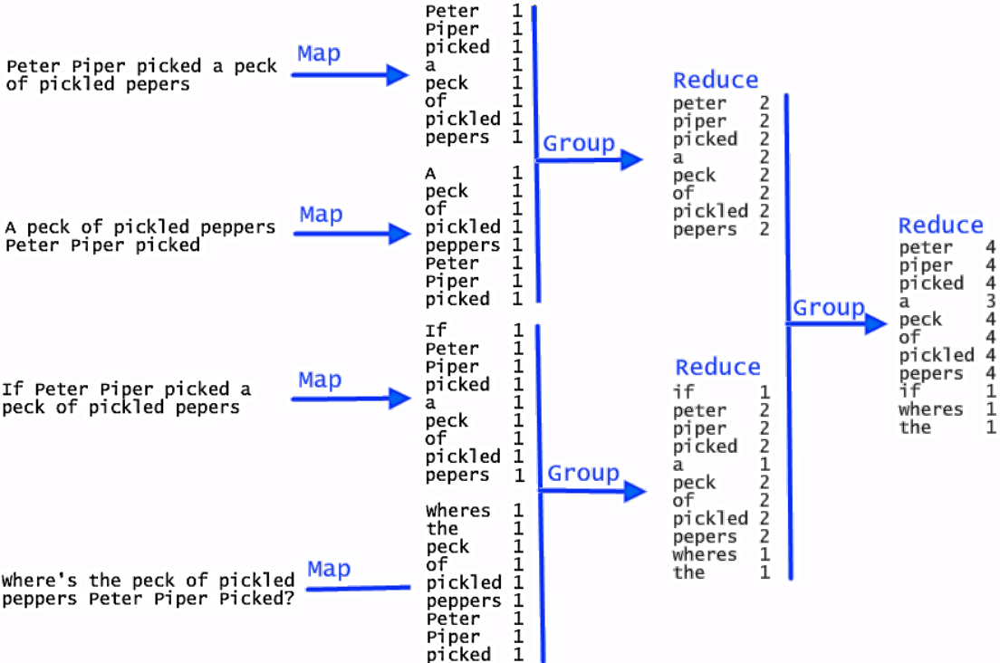

Modelación de Bases de datos (sharding, particiones, master/slave, raid, ...)

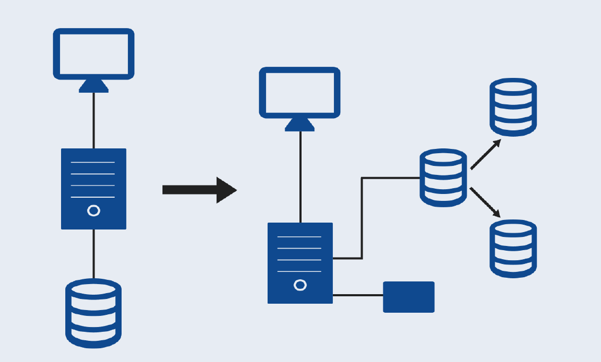

En la imagen anterior, la caja azul representa el cache. ¿Cómo funciona?

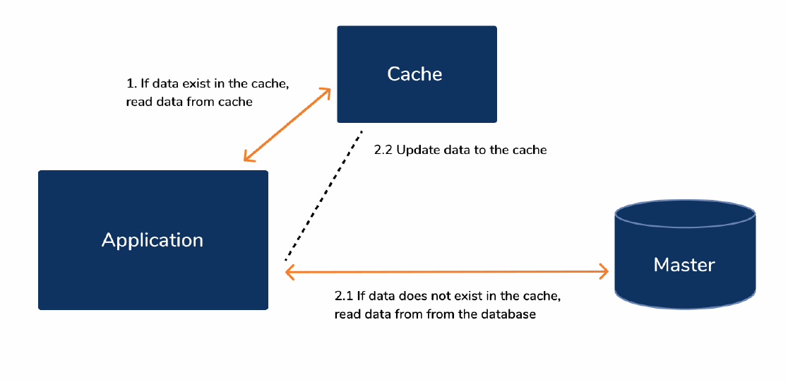

Configuración ~~Master Slave~~ Lider Seguidor

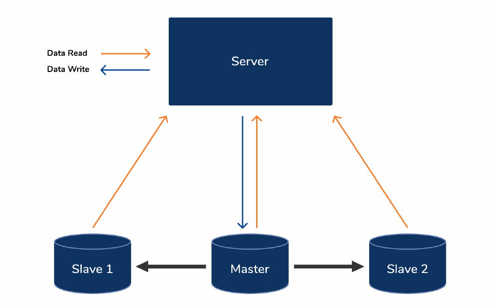

Sharding

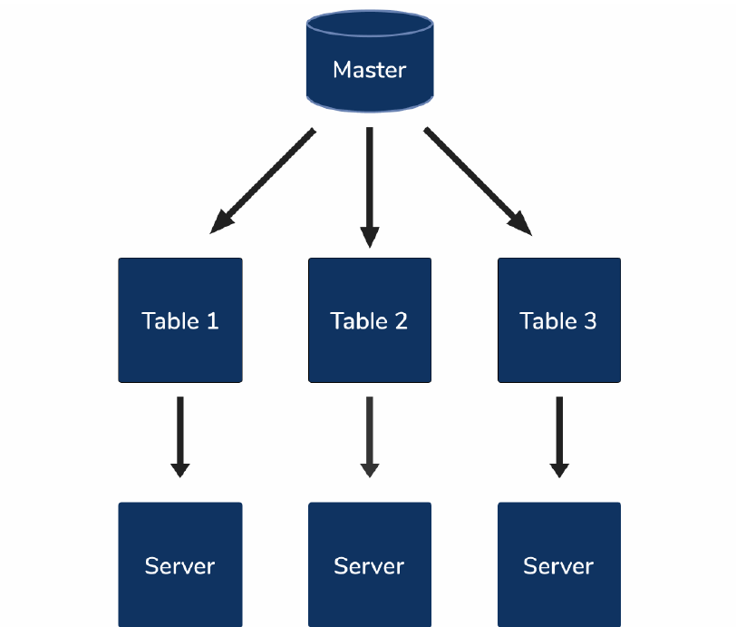

Partitioning

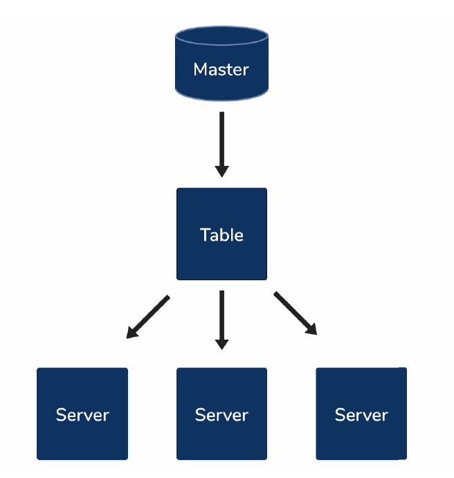

## Posibles problemas (costos)

* Añadir nuevas features se vuelve más complejo
* El sistema se vuelve más complejo
* El código se puede volver menos testeable
* Identificar y corregir defectos/bugs se vuelve más complejo

## Ejemlpo de escalabilidad - Google

La tarea ordenar 1 PB = 1.000 TB = 1.000.000 GB

Ordenar 10 Trillones (TB) de registros de 100 bytes
* 6 horas, 2 minutos
* 4.000 computadores
* Replicado 3 veces en 48.000 discos

Arquitectura:
* Linux
* Python, Java, C++
* +200 GFS clusters
  * Un clusster: 1.000 a 5.000 máquinas
    * Dual Core, GB ethernet, 4-8 GB RAM
    * Tasa de lectura/escritura 40 GB/s
* 6.000 aplicaciones MapReduce
* BigTable almacena billones de URLs, cientos de TB de imagen satelital, preferencias de cientos de millones de usuarios

El stack:
* Prodcutos: search, advertising, email, maps, video, chat, blogger
* Infraestructura de sistema distribuído: Google File System, Map Reduce, BigTable
* Plataforma: máquinas baratas en diferentes data centers

Google File System
* Sistema de archivos masivos, estructurado, distribuído
  * Alta confiabilidad entre data centers
  * Miles de nodos en red
  * Alto ancho de banda R/W
  * Bloques de datos en GBs
  * Operaciones: create, delete, open, close, read, write, snapshot, append

Big Table:
* Más reads que writes
* Fallas en componentes son comunes
* Discos baratos
* Mecanismos de recuperación de datos simplificados
  * row, col, timestamp
  * Búsqueda de valores (key, value)
  * No hay operadores relacionales
  * Números de columnas variables
  * Tipo de datos diferentes para cada columna
* Es un mecanismo de hash distribuído construido sobre GFS. No soporta SQL, sino búsquedas por key
* Las DBs comerciales no escalan a este nivel y no funcionan sobre miles de máquinas
* Cada dato es guardado en una celda que se accede usando una key de tos, columna o timestamp
* Cada fila se guarda en una o más tablets
* Una tablet es una secuencia de bloque de 64KB en un formato llamado SSTable
* Master server:
  * Asigna tablets a servidores Tablet. Siguen la pista de la ubicación de las tablets y las redistribuyen si es necesario
* Tablet server:
  * Procesa requests de lectura/escritura para tablets
  * Divide tablets grandes (100MB - 200MB)
  * Si falla, 100 tablets server toman una nueva tablet
* Chubby Lock Servers:
  * Operaciones tales como abrir una tablet para escritura, árbitro de master y ACL requieren exclusión mutua.

# Clase 7 - Performance

Es un atributo de calidad observable cuando el sistema está en ejeución (dinámica)

Propiedadses no observables en el tiempo de ejecución (estática)
* Modificabilidad, portabilidad, reusabilidad, itegrabilidad, testeabilidad

Capacidad del software para dar una respuesta
* Depende de la comunicación e interacción entre componentes del sistema

¿Cómm medir performance?

* Experimental: mediciones de request, transacciones, etc
* Teórico: modelo etocástico de colas del sistema basado en escenarios de carga de trbajo.
    * Técnica analítica: tasa de llegada y distribución de solicitudes de servicios, tiempos de procesamiento, tamaños de colas y latencia
    * Simulación

## Estrategias para mejorar el desempeño

Considerar el hardware

Mejoras estructurales
* Bases de datos
  * Indexar, normalizar vs desnormalizar, SQL vs NoSQL

Usar caches

Haz menos
* Evitar correr código innecesario
* Evita instanciar objetos innecesarios
* Evita abstracciones innecesarias
* Conectores más sencillos
* Toma el camino más corto posible (reduce el stack)
* Delega tareas (jobs, crons, delegar ejecución de código a un tercero)

Considerar un optimizador automático de código
* JVM

## Hardware

Lectura de memoria
* CAS Latency: tiempo de transferencia entre el momento en que el controlador de memoria indica al módulo de memoria acceder a una posición de la RAM y el momento en que la data está disponible (ha sido leída)

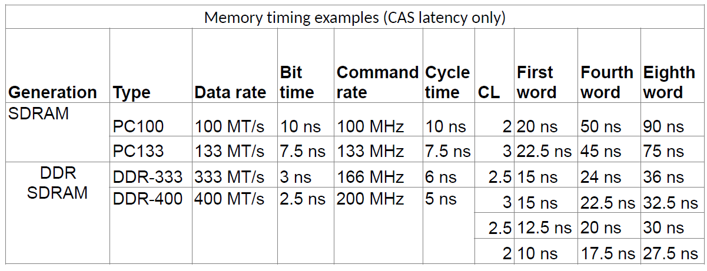

Operaciones de punto flotante (lentas) VS Operaciones con enteros
* Depende del tipo de operaciones, de la arquitectura del CPU, etc

Disco duro

CPU (reloj)

RAM

Ancho de banda
* Tráfico de internet: streaming video/audio, protocolos codiciosos (bit torrent), etc
* Cloud computing
  * Replicación y redundancia agrrega los retrasos en las lecturas/escrituras en disco
  * Aumenta el consumo de ancho de banda
  * Peor si es sobre internet

## Cache

En lugar de descargar contenido desde un servidor remoto, los navegadores lo descargan de un servidor geográficamente cercano o conectado por un enlace de red rápida

* Almacenamiento en caché del navegador
  * Copias cercanas y rápidas, pero descargas por un solo usuario
* Almacenamiento en caché de una red (proxy cache, interception cache)
  * Copias cercanas por cada usuario que decargó el contenido (ahorra ancho de banda)
* Almacenamiento en caché de una red de distribución de contenido (CDN, reverse proxy, gateway cache. surrogate cache)
  * Usado po empresas (webmasters) que quieren que su contenido sea accesible rápidamente en todas partres
  * Akami

## ¿Cómo manejar los caches de la web?

Objetivo del cache:
* Reducir latencia
* Reducir táfico de red

Efectos secundarios
* Ocultan el tráfico real de un sitio web
* Sirven contenido añejo

## Reglas de los cache
1. Si el response Header dice No-Cache, no se cachea
2. Si el request es autenticado o seguro (HTTPS), no se cachea
3. Una representación cacheada es fresca (se sirve del cache) si:
     * Tiene fecha de expiración o header Age-Control < actual
     * El cache ha visto la representación hace poco y fue modificada hace tiempo (Last-Modified)
4. Si una representación es añeja (stale), se pedirá al servidor de origen validarla
5. Bajo ciertas circunstancias (offline) se servirá la respuesta añeja sin chequear con el servidor de origen.

## Diseñando sitios web sensibles al cache

Usar URLs de manera consistente

Usar librerías de imágenes comunes

Marcar imágenes y páginas que no cambian a menudo con Cache-control: max-age y un valor grande

Ajustar el valor de max-age o Expires apropiado para los otros recursos

No actualice archivos de manera innecesaria (falso Las-Modified)

Usar cookies cuando sea necesario (son difíciles de cachear, sólo usar en páginas dinámicas)

Minimice SSL

Validar páginas con redbot.org

# Clase 8 - Seguridad

Meta: proteger recursos contra amenazas. Corrupción, accesos no autoirzados, denegación de acesos autorizados, software malicioso.

Medidas:
* Limitar físicamente el acceso a usuarios confiables
* Mecanismos de hardware
* Mecanismos de sistema operativos que impone reglas a programas no confiables
* Antivirus
* Técnicas de aseguramiento de código

## Metas de seguridad

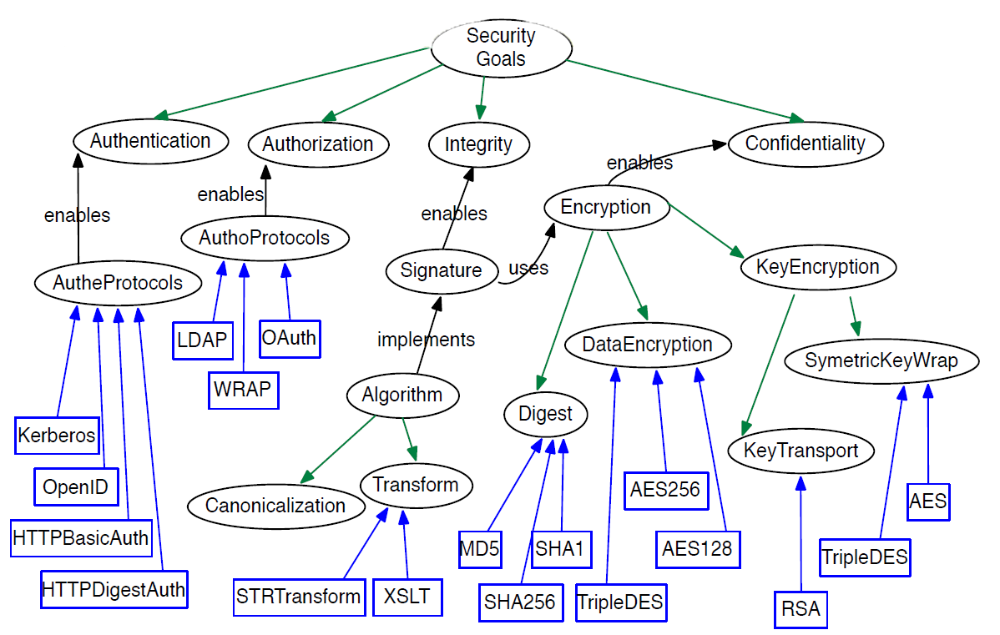

## Arquitectura de seguridad

Especifica los mecanismos de seguridad a ser parte de la arquitectura de software

* Subsistemas: servidores web, servidores de aplocación, DBMS, directorios, aplicaciones web y aplicaciones legadas
* Conectores entre subsistemas: llamadas a funciones remotas o locales, protocolos (SSL, HTTPS, LDAP)
* Mecanismos específicos: autenticación y autorización, encriptación, auditoría, manejo de bitácoras, monitoreo, detección de intrusos, registros, backup, recuperación ante fallas.

## Malware o softweare malicioso

Cualquier programa que va contra los inntereses del usuario

**Backdoor**: Acceso ilimitado al equipo

**Denial of servise (DoS)**: infectar una cantidad enorme de máquinas para conectarse simultáneamente a un servidor, sobrecargarlo y hacerlo caer

**Distributed Denial of Service (DDoS)**: idéntico al anterior pero el ataque proviene de múltiples fuentes

**Vandalismo**: cambiar un sitio web

**Robo de recursos**: robar recursos de computación y redes

**Robo de información**

## Tipos de malware

**Virus**
* Programa que se auto-replica con malas intenciones
* Deben ejecutarse (iniciarse) por un humano
* Polimórficos: encriptan el código con una llave (firma) random y lo desencriptan al momento de ejecutarse
* Cada copia parte con una seed diferetne para el random
* Se puede almacenar (antivirus) las llaves o firmas conocidas de los virus
* Metamórficos: cambian el código completamente al copiarse
* Pueden interceptar lecturas al *filesystem* por parte de los antivirus y simular que no existen

**Worms**
* Similares a los viruses pero no necesitan ser ejecutadas por personas, explotan vulnerabilidad del S.O. o de aplicaciones
* Se propagan por la web
* Worm kleptográfico: usan una llave para encriptar infroamcióñ que roban del usuario

**Backdoor**
* Crea un canal de acceso encubierto para conectarse, controlar, espiar y manipular la máquina de la víctima

**Troyanos**
* Incrustan código malicioso en una aplicación aparentemente inocente

**Adware**
* Programa que fuerza llamadas a publicidad (advertising) no intencional
* Objetivo: perfilar al usuario (hábitos de browsing y compra)

**Sticky software**
* Impiden al usuario desinstalarlo de manera simple

## Vulnerabilidades por protocolos de comunicación
Spoofing:
* IP
* UDP
* Conexión TCP

Ataques:
* TCP sequence number
* Internet routing
* ICMP redirect
* PoD (ping of death)
* ARP
* TCP SYN Flood
* IP fragmentation
* UDP Port DoS (Denial of Service)
* Random port scanning
* Packet sniffers (eavesdropping)
* Connection hijacking

## Vulnerabilidades de las aplicaciones web
"If builders built buildings the way programmers wrote programs, then the first woodpecker that came along would destroy civilization" - Weinberg's Second Law

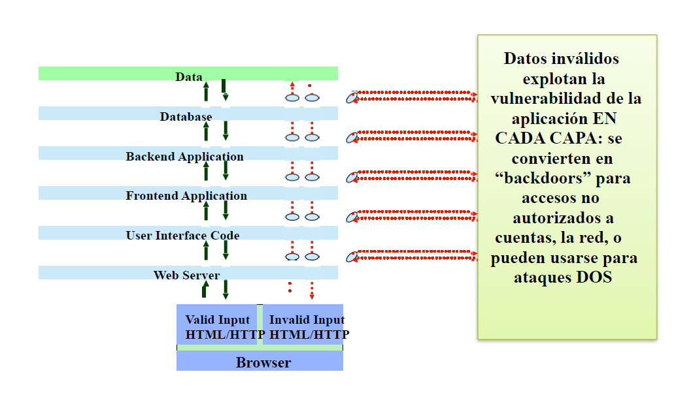

## Otros errores

Contraseñas fáciles de identificar

Compartir información privada en servicios públicos

Listar información de directorios web

Versiones sedactualizadas de software de terceros

Servicios innecesarios en el servidor

## Tipos de ataque

|Application | Attack types | Negative outcome |
|------------|--------------|------------------|
| Form fiels: collect data | Bufferoverflow | Crash servers/close business |
| Customer account | Cookie poisoning | Identity theft/illegal transactions |
| Online shopping | Hidden fields | eShoplifting |
| Sloppy code | Backdoors/debug options | Download proprietary database |
| Text field: collect data | Cross site scripting | eHijacking - Get Account info |
| Database | Parameter Tampering/SQL injection | Fraud |
| Backend Apps | Stealth Commanding | Site defacement |
| Web server | Published vulnerabilities | Crash site |
| Dront end apps | 3rd party misconfiguration | Admin access |
| Web server | Forceful browsing | Access Sensitive data |

## Same origin Policy

Política de seguridad para lenguajes que se ejecutan en el lado del browser (ej: javascript)

Los scripts que corren en páginas servidas por un sitio acceden únicamente a los objetos, métodos y propiedades (DOM, cookies) de las páginas originadas en el mismo sitio, pero previenen el acceso a los metodos y propiedades de sitios diferentes

## CORS (Cross Origin Resource Sharing)

HTTP requests a recursos de dominios diferentes al dominio del recurso que hace la llamada

## Social engieneering

El arte de manipular a las personas para que divulguen información cofidencial.

Pretexto: crear un escenario falso, impersonar, etc

Desvío: engañar a alguien de entregar algo a quien no corresponde

Phishing: obtener información privada de manera fraudulenta

Piggybacking: aprovevharse de los permisos de alguien para colarse a continuación

## Phishing

la forma más común es utilizar un email indicando que una cuenta necesita actualización. Obviamente hay que fijarse en la URL: ver si el host esdiferente al que debería ser. Ver si tienen caracteres numéricos sospechosos.

Para evitar esto muschos mails legítimos ya no contienen links (paar forzarte a ir al sitio original)

## Navegación anónima

**Función de los proxys:**

Proteger privacidad:
* Ocultar la dirección IP del cliente
* Remover información de los headers HTTP
* Remover coockies o eliminar las cookies falsas (hay registros)
* Generar ruido para distorcionar el perfil del usuario

Niveles:
* Browser
* Rdes locales
* Web: proxies anonimizadores

## Otros threats

Autentificación y aplicaciones:
* Passwords débiles
* Passwords sniffers
* Ataques a DNS, SMTP, NFS, Remote Login, X-Windows
* Finger, whois, echo, ping, traceroute
* URL y Web spoofing
* Ataques CGIs

## Firewalls

Provee conectividad segura entre redes

Permite aplicar una plítica de seguridad

Registra tráfico entrante y saliente:
* Direcciones IP, puertos y usuarios

Filtro de paquetes: bloquea paquetes inválidos (IPs), puede ser router, bridge, host

Aplication proxy: programa (encriptación)

Separar srvicios inteernos (gateways) de externos (DNS, sebservers, etc)
* DMZ (De-Militarized Zone)
* Area entre 2 filtradores (interno/externo de paquetes)

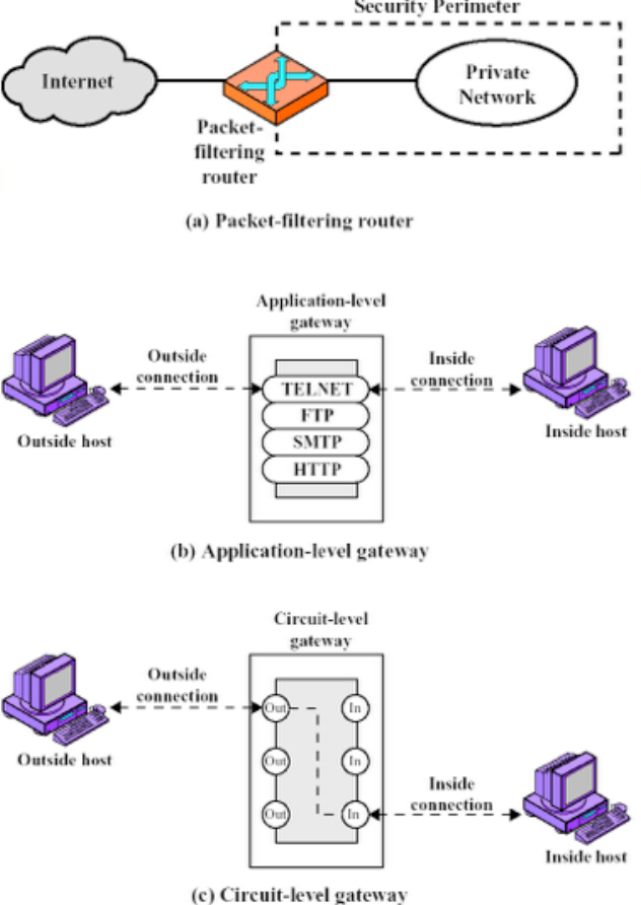

## ACL (Acess Control list)

Define los permisos (operaciones) asignados a un objeto según el usuario

## Autenticación en la web

API Key:
* Credenciales: developer key, developer token, token IDm userIDm user key

Username / Password

## Json Web Tokern (JWT)

Almacenamiento deinformación de manera stateless

Compacto

URL - safe

Pueden estar autenticadas y encriptadas

Pueden caducar(fecha de expiración en la encriptación)

## Seguridad

Protect the Brand Your Customers Trust

Know Your Business and Support it with Secure Solutions

Understand the Technology of the Software

Ensure Compliance to Governance, Regulations, and
Privacy

Know the Basic Tenets of Software Security

* confidencialidad, integridad, disponibilidad,
* autenticación, autorización, “responsabilidad”,
* configuración de uso, sesiones y excepciones

Ensure the Protection of Sensitive Information

Design Software with Secure Features

Develop Software with Secure Features

Deploy Software with Secure Features

Educate Yourself and Others on How to Build

Secure Software

# Clase 9 - Integración

## Motivación

***Heterogenidad**
* Diferentes formatos, semántica de los datos, lenguajes y plataformas de Software y Hardware
* Aplicaciones empresariales: ERP (Enterprise Resource Planning), SAP, PDM (Product Data Managment), SCM (Software Configuration Managment), B2B, etc

**Aplicaciones de integración y middleware (AIM)**
* $6.400 millones en el 2005
* $ 11.000 millones en el 2007
* $28.500 millones en el 2017
* Pérdidas por mala iontegración (CAD) $1000 millones (2002)
* Diferentes empresas, data operacional, data no estructurada, AIM incompatible

## Integración

Esfuerzo requerido para integrar una aplicación en un contexto mayor

A nivel de datos(DB accesibles a otras aplicaciones)
* Flexible, simple y peligrosa

API (Application Programming Interface)
* Funciones (parametrizadas) que controlan el acceso a los datos. Garantizan integridad de datos y reglas de negocio
* Compleja, costosas y segura

Middleware
* Software especializado en integración

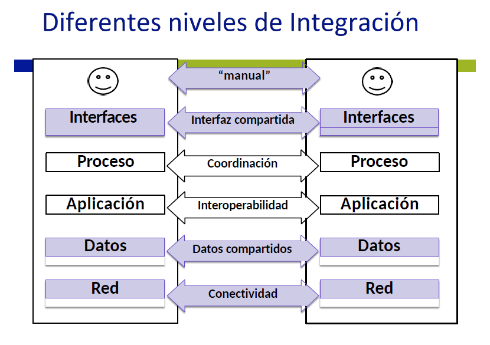

## Deployment

Deployment es el proceso de montar el sistema en el hardware
* Cambiar en tiempo de ejecución se llama migración o redeployment
* En las presentaciones vimos algunas formas de lelvar a cabo este proceso (BlueGreen, CanaryRelease, DarkLaunching, ProductionInmuneSystem)

Actualmente los grandes sistemas evolucionan continuamente

Un sistema puede estar en varios hosts

Dependiendo de la configuración y las necesidades de los componentes del sistema, estos pueden compartir:
* Hardware
* Network
* Otros dispositivos
* Datos

Proceso
* Antes: mediante CD, todo el sistema
* Ahora: instalación integral del sistema, con actualizaciones frecuentes

## Deploy automatización
Buenas prácticas
* Utilizar un repositorio
* Automatización del Build
* Tests automáticos al crear el build
* Todos hacen comit siarios
* Cada commit debe provocar un build
* Mantener el build rápido
* Testyear en un clon del ambiente de producción
* Facilitar el acceso a a las versiones
* Visibilidad de los resultados del build
* Automatizar el deployment
## Deploy herramientas deployment

Redución del tiempo de entrega

Reducción de errores

Repetible (se configura una vez, se usa muchas)

Cualquier miembro del equipo puede realizar el deployment

Mayor tiempo utilizado en desarrollar

Realizar deployment a un nuevo sistema resulta más sencillo

Deploys más frecuentes

Git hook
* Configurar un servidor para ejecutar un script tras actualizarse el código

Capistrano
* Permite añadir la configuración al repositorio el mismo
* Cualquier miembro del equipo puede hacer deploy con "cap deploy"
* Fácil de configurar

Puppet
* Una de las herramientas más antiguas, maduras y estables
* Basado en Ruby, pero usa DSL parecido a JSON
* Tiene una estructura cliente servidor
* Tiene una interfaz madura y corre en casi cualquier SO
* CONS: no está diseñado para ser simple y gracias al uso del DSL, el códdigo crece muy rápido en poroyectos simples

Chef
* Basado en Ruby y Erlang, Ruby DSL para la declaració de recetas
* Tiene una estructura cliente-servidor
* Riene una interfaz madura y corre en casi cualquier sistema operativo
* Muy similar a puppet
* Gran cantidad de recetas de módulos creadas por la comunidad
* CONS: difícil de aprender si se tiene poco manejo de Ruby y programación procedural

Ansible
* “Ansible is a radically simple IT automation system. It handles configuration-management, application deployment, cloud provisioning, ad-hoc task-execution, and multinode orchestration - including trivializing things like zero downtime rolling updates with load balancers...”
* Desarrollada en python, pero soporta extensión de módulos en cualquier lenguaje

## Deploy automatización
* Es más fácil de detectar errores más temprano en el ciclo de desarrollo
* Testing automático
* Evita errores de último minuti
* Al haber poco código entre cada build es más fácil de arreglar entre cada build, es más fácil de arreglar en caso de fallas
* Siempre hay builds disponibles para release/testing/demo

Continuous integration:
* El proceso de realizar builds automáticamente y correr tests en el software, de manera regular

Continuous delivery
* Si los tests corren constantemente y hay confianza en ellos, entonces es posible hacer releases en cualquier momento

Continuous deployment
* consiste en entregar los releases al cliente a penas el software esté listo, como en SaaS

## Deploy versonamiento
No hay un estándar universal

Recomendado el formato X.Y.Z
* X: major number. Sólo debe aumentar cuando la nueva versión se hace incompatible con anteriores
* Y: minor number. Aumenta cuando se agregan funcionalidades retro compatibles
* Z: patch number. Aumenta cuando se corrigen bugs de versiones anteriores

Además se recomienda agregar un último number que tebga relación con el build del código

## Deploy estrategia Netflix

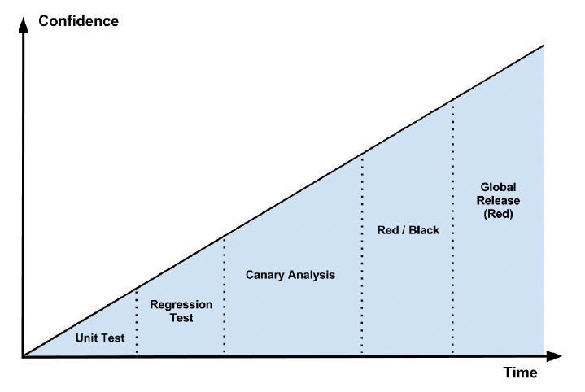

## Deploy estrategias
Canary release
* Minimiza el impacto de una falla
* No hay mejor tester que los mismos usuarios
* Desafíos
  * Manejar múltiples versiones de software
  * Integrar diariamente
  * Enfoque ágil
  * Monitoreo y control
  * A/B testing

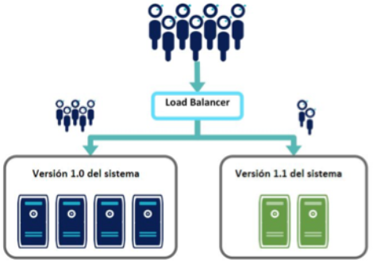

## Deploy estrategias: Blue/Green Deployment
Stateless
* Cookies, archivos, cache
* Servicios externos

Databse migrations
* BD compartida
* Cambios no afecten al servidor online

Non-Destructive Migrations
* Eliminación de tabla
* Verificar que no afecte a la aplicación
* Lanazamientos chicos y frecuentes

Dark Launches
* Sin cambios en el UI
* Observar el comportamiento del servidor

## Middleware

Básicamente se divide en integración y aplicación

## Middleware a nivel de la capa de transporte: CORBA

Common Object Request Broker Architecture

Servidor implementa una interfaz especificada en IDL (Interface Description Language), describiendo métodos, parámetros y tipos de retorno válidos

El cliente serializa su solicitud, la envía al servidor y queda bloqueado esperando la respuesta

El servidor deserializa la solicitud, procesa, serializa su respuesta y la envíá de vuelta

## Middleware orientado a mensajes (MOM)

El middleware es un servidor de colas entre clientes que toman los roles de sender y receiver

El sender no se queda bloqueado esperando respuesta (send and forget)

Tiene alta escalabilidad, disponibilidad y tolerancia a fallos lograda vía replicación del servidor MOM

Limitación: el formato de datos debe ser conocido

## Middleware basado en publisher/subscriber

MOM: mensajes 1 a 1

Publisher subscriber: mensajes 1-N, N-N, N-1

Asíncrono, send and forget

## Middleware basado en brokers

El broker es un intermediario entre los senders y lso receivers

Dos responsabilidades
* Ruteo: el broker conoce a qué receptor debe despachar el mensaje recibido
* Transformación: el broker encapsula reglas de transformación de mensajes

Escala (disponibilidad, tolerancaia a fallos) muy bien vía replicación

No hay límite en el dormato de datos

## Middleware basado en Business Process Orchestrarion

Un motor de procesos de negocios es un broker que además:
* Maneja estado (persistencia)
* Vincular los pasos de una lógica de procesos de negocio con sistemas de software usando diferentes tipos de conectividad (http, colas de mensajes, archivos -> puertos)
* Define los pasos de control de flujo (no solo in-out, sino bucles/ciclos, ejecución condicional, etc)
  * Se convierte en punto único de falla
  * Encapsula toda la complejidad del control de flujo en cada proceso de negocio
  * Como maneja persistencia no es trivial hacerlo escalar

## Problemas con el middleware

Objetivo de los vendedores de middleware
* Segmentar mercados y mantener clientes cautivos
* Guerra del middleware

La integración de grano fino...
* Necesaria para aplicaciones específicas (rendimiento)

... es diferente de la integración de grano grande
* Sistemas débnilmente acoplados a niveles de trancisiones

Además se requiere definir criterios de calidad de la conversación entre cliente/middleware/servidor
* Seguridad, transacciones, manejos de recursos

## SOC (y SOA) son una generalización abierta de CORBA y los brokers

SOC (Service Oriented Computing)
* Paradigma que usa el servicio como idea básica para permitir el desarrollo de aplicaciones interoperables , masivamente distribuídas, capaces de evolucionar, de manera rápida y a bajo costo
* Un servicio es un mecanismo que permite acceso a una o más funcionalidades de negocios bien definidas y bajo el control de diferentes propietarios

SOA (Service Oriented Architecture)
* Estilo arquitectónico que sigue la línea de SOC y permite la viibilidad de los servicios y su descripción, la descripción de los efectos del servicio, su ejecución, políticas e interacción

## Paradigmas SOA

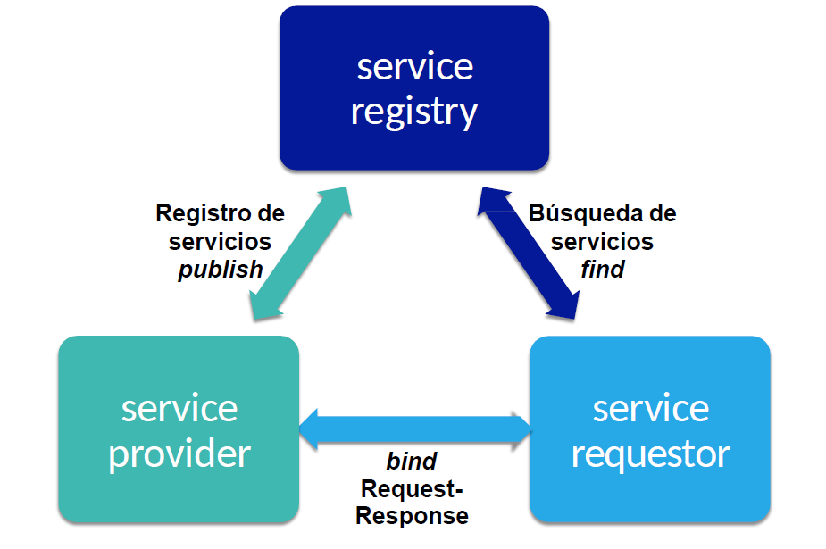

## Web services

Es un conjunto de estándares de la W3C

Sistema de software diseñado para permitir interoperabilidad máquina - máquina sobre la red

Tiene una interfaz (operaciones y parámetros) descrita en formato estándar procesable por máquinas: WSDL (XML)

Los mensajes se intercambian siguiendo el estándar SOAP

Los mensajes SOAP típicamente se envían sobre HTTP serializados en XML

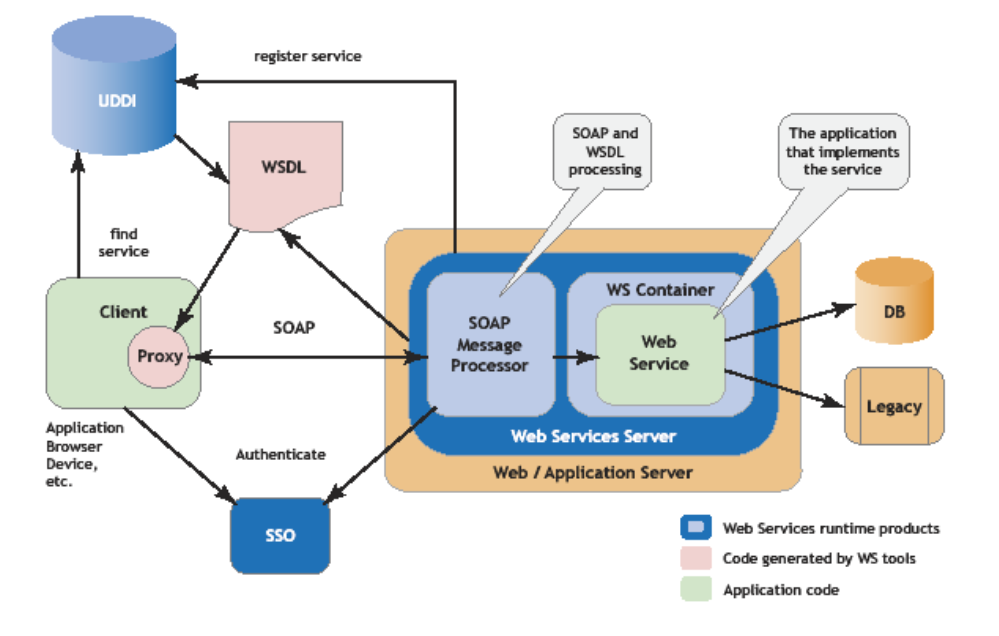

## WSDL

Web Services Description Language

Formato XML

Tipos de Datos definidos en XML Schema

Describe:
* Operaciones y tipos de datos del Web service para ser llamado (input / output)
* Ubicación del Web Service (URI)
* Método de envío de mensajes

## Dos visiones

SOA: Service Oriented Architecture
* Punto central de control, diseño (Arquitectura)
* Sistemas acoplados
* Publicar APIs es muy barato (WSDL)
* Modelo de datos compartido, servicios transparentes
* Intranets

REST
* Múltiples partners independientes y autónomos con modelos de datos propios
* Ingeniería de documentos: modelar las transacciones de modelos de negocios como una serie de intercambios de documentos (representaciones de artefactos)
* ROAs: mayo esfuerzo pues requiere identificar los recursos y planificar e implementar los nombres de recursos y su manejo

## REST (Representational State Transfer)

Roy Fielding, 2000. Autor principal de HTTP 1.1 (1999) y autor secundario de URI Syntax (1998)

conjunto de restricciones arquitecturales que subyacen a la Web

Estilos arquitectónicos y el diseño de arquitecturas de software basadas en redes

## Árbol de derivación de REST

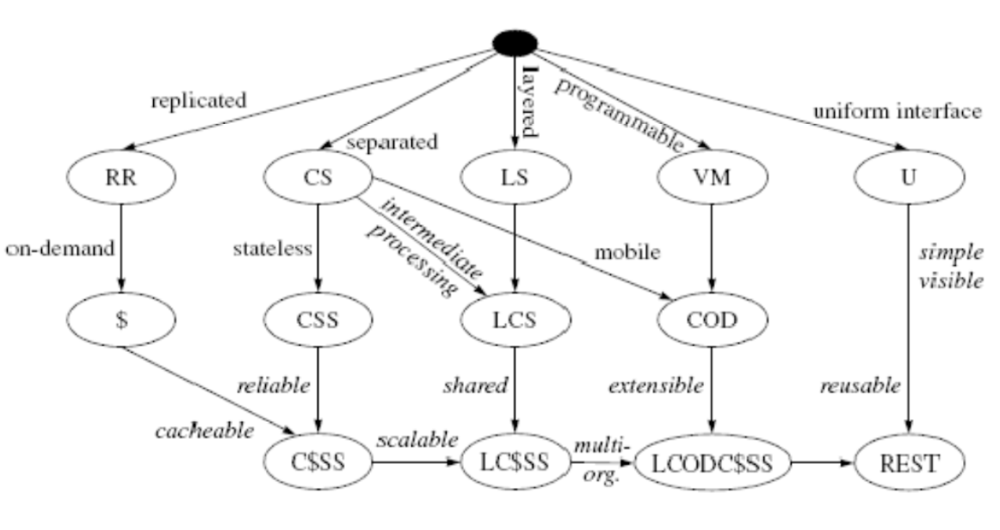

## Propiedades de calidad que REST considera

Network Performance
* Throughtput: tasa de transferencia de datos entre componentes
* Overhead: seteo de inicio, por cada interacción
* Bandwidth: throughtput máximo disponible en un enlace de red
* Bandwidth usable: porción del ancho de banda disponible para la aplicación

Network Efficiency
* Minimizar el uso de la red (caching, replicar data, operaciones offline, mobile code)

User perceived performance
* Latencia: tiempo desde el estímulo inicial dado por el usuario hasta la respuesta del sistema

Confiabilidad
* Grado de confianza en la no falla del sistema
* Redundancia, evitar puntos únicos de falla, monitoreo

Escalabilidad
* Crecimiento de componentes o interacciones entre componentes
* Distribuir sevicios entre componentes, simplificar componentes

Simplicidad
* Separación de responsabilidades. Conectores genérios

Visibilidad
* De las interacciones entre componentes
* Mejora performance vía caching, servicios en capas
* Mejora confiabilidad vía monitoreo
* Mejora seguridad vía inspección por mediadores (firewalls)

Portabilidad
* Incluye mover código

**Modificabilidad:**

Evolución
* La imnplementación de un componente puede cambiar sin afectar al sistema

Extensabilidad
* Añadir funcionalidad al sistema dinámicamente (cuando el sistema está deployeado)
* Reducir acoplamiento entre componentes

Personalización
* Especializar temporalmente la conducta de un elemento arquitectónico (ej. Para un cliente)
* Evaluación remota de código de baja demanda

Configurabilidad
* Modificación post-deployment de componentes o de sus configuraciones

Reusabilidad
* Componentes, conectores o elementos de datos pueden ser reusados, sin requeir modificaciones, en otras aplicaciones
* Reducir acoplamiento, interfaces genéricas

## Propiedades deseables de mantener en la web

Barrera de entrada baja (autores, editores, lectores)

Extensibilidad

Hipermedia distribuida

Escalabilidad masiva y anárquica

Deployment independiente

## Estilos arquitectónicos que influencian REST

Jerárquicos (módulos en capas)
* CS: Client Server
* LCS Layered Client Server
* CSS Client Stateless Server: no se permite información de estado de la sesión en el sevidor
* C$SS Client-Cached Statless Server: cache mediador entre cliente y servidor
* LC$SS Layered Client-Cached Stateless Server: añade proxy y gateway

Replicación
* RR Repositorio Replicado
  * Servidores descentralizados en cluster
  * Cliente: ilusión de que interactúa con un solo servidor
* $ Cache: la respuesta a una solicitud puede ser usada varias veces

Código móvil
* VM Virtual Machine: intérprete en un ambiente controlado
* COD Código baja demanda: un cliente solicita código que se ejecuta localmente
* LCODC$SS: Layered, Code On Demand, Cient-Cached Stateless Server

Interfaz uniforme entre componentes
1. Identificar recursos (ej. URI)
2. Manipular recursos mediante representaciones (ej. HTML)
3. Mensajes auto-descriptivos (ej. HTTP)
4. Hypermedia como Motor de Estado de Aplicaciones (HATEOAS)

## ¿Que NO es REST?

No es un estandar de APIs web

No son APIs que retornan JSON

No es un estandar para nombrar o formar URI
* No promueve URIs anidadas ni índices incrementales

No es lo mismo que un CRUD

No está ligada a HTTP

## ¿Qué es un recurso?

Abstracción clave de información

Si tiene un nombre, puede ser un recurso

Debe tener una URI como ID

## ¿Qué es una representación?

Una fotografía de un recurso en un momento del tiempo en algún formato

Puede ser un texto plano, una imagen, JSON, HTML, YAML, csv, etc.

## Rest es un estilo arquitectónico

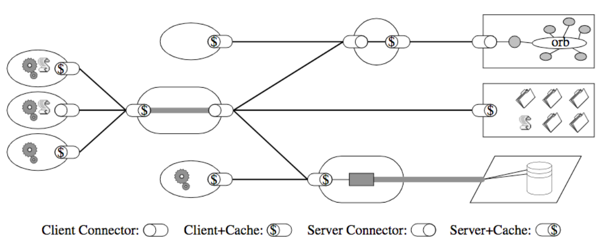

## Principios REST

1. C/S
2. Capas
3. Cacheable
4. Stateless
5. Code on demand
6. Recursos identificables
7. Manipulación mediante representaciones
8. Mensajes autodescriptivos
9. Hypermedia como motor de estado de la aplicación

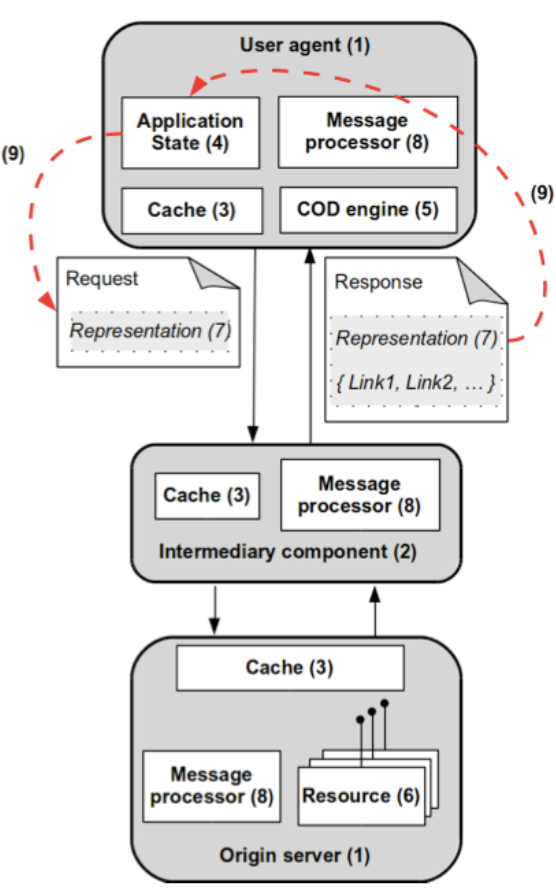

## Esto es importante

Interacción Stateless
* El servidor no almacena información del estado de su convesación con el cliente
* Cada request del cliente envía toda la información necesaria. El estado de la sesión se mantiene en el cliente
* El sevidor podría ser stateful, es decir, el estado del lado del servidor puede ser accedido mediante URLs (el servidor mantiene el estado del recurso)

Interfaz uniforme
* Diferencia a REST de otros enfoques

## Web client - Web server interaction

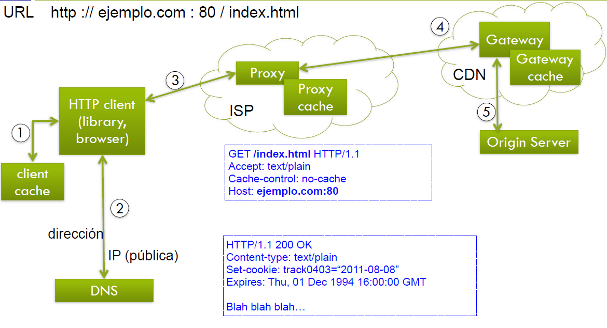

## Restricciones de interfaz uniforme

Los recursos tienen identificadores únicos y opacos
* URI: http://ejemplo.com/cliente/bar/orden/1
* Evitar acoplamiento entre clientes y servidores
  * Opaco: el cliente no debe adivinar la URI
  * El antipatrón más usado en la web es http://{host}/{service}/{id}

Los recursos son conceptuales (entidades) y se sirven al cliente mediante representaciones 
* Los formatos de representación pueden negociarse
* Estándar para formatos: media types o MIME (Multipurpose Internet Mail Extensions)
* Cliente puede preferir JSON, XML, XHTML en ses orden;
  * Header: `Accept: application/JSON, application/xml`

Los recursos son autodescriptivos y estándar
* Las operaciones HTTP tienen semánticas conocidas que afectan o no el estado de los recursos
* Depende del protocolo. Por ejemplo en HTML:

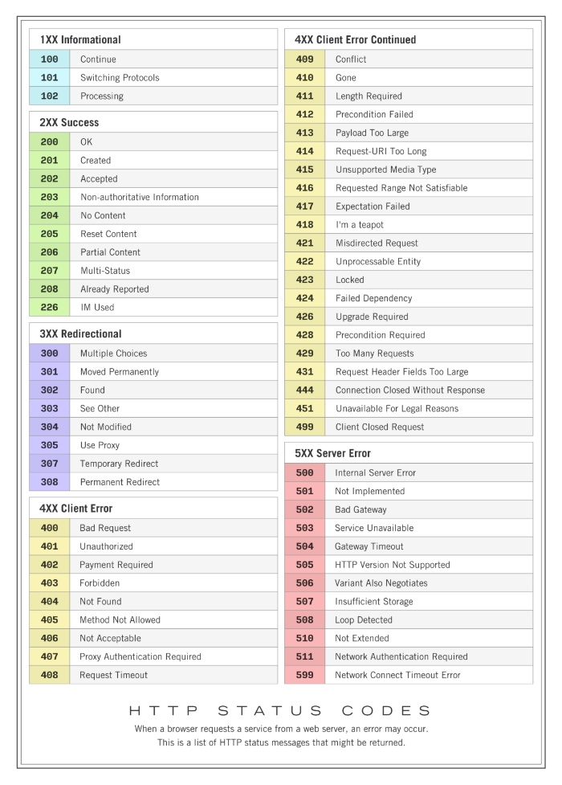

HATEOAS (Hypertext as the Engine of Aplication State)
* Las representaciones contienen los links necesarios para navegar, descubrir otros recursos y los controles para cambiar su estado

## Malas prácticas

Incluir el método en la URI
* `http://host.com/servicio/version/recurso?method=get`
* `http://host.com/servicio/version/get_recurso`

Incluir el formato dle recurso en la URI
* `http://host.com/servicio/recurso.json`

URIs no opacas (URI-template)
* `http://host.com/servicio/version/recurso?method=get`

## Niveles de madurez de REST

Nivel 0 - No es REST: el pantano POX (Plain Old XML)
* Intercambio depende del contenido, mal uso de los verbos, no hay recursos diversos: URI es un endpoint (escucha todas las operaciones)

Nivel 1 - No es REST: Recursos
* Los recursos se identifican con URIs separadas, uso mínimo de verbos

Nivel 2 - No es REST: Verbos HTTP
* Recursos identificados con URIs, uso de verbos y códigos de respuesta

Nivel 3 - REST: Controles Hipermediales
* Recursos identificados, uso de verbos, recursos interlinkeados

## Ventajas y limitaciones

Las operaciones son estándar
* Los clientes pueden hacer supuestos seguros

El servidor no guarda estado de la conversación
* Escalabilidad masiva
* Caches (GET)
* (-) Cada mensaje debe enviar toda la información necesaria para completar la operación

No hay una descripción estándar
* El cliente puede cambiar el recurso, el cliente falla graciosamente
* (-) Destinado al consumo humano
* (-) Follow your nose
* 
## Resumen Principios REST

1. Cliente - servidor
2. Stateless
3. Cacheable
4. En capas
5. Código móvil
6. Interfaz uniforme
  * Recursos tienen ID
  * Los recursos se manipulan a través de sus representaciones
  * Mensajes autodescriptivos
  * HATEOAS

## Mensajería entre sistemas Pipe and Filter Publisher Subscriber Broker

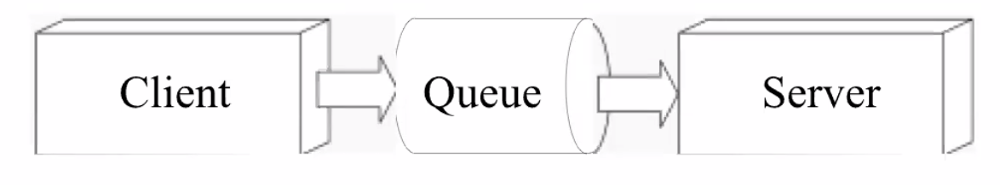

Comunicación asíncrona: el client envía mensajes a una cola y continúa con sus tareas sin esperar una respuesta. Los mensajes se toman después y se procesan

Calidad del servicio: la cola puede configurarse para garantizar entregas rápidas (no confiable) o lentas (confiable). Puede coordinarse mediante transacciones a DB.

Acoplamiento débil: no existe conexión directa entre clases y servidores

Recomendable: el cliente no requiere respuestas inmediatas ante solicitudes. Resilencia ante red/servidor no confiable

## Pipe and filter

|Atributo de calidad|Ventajas|
|-------------------|--------|
| Disponibilidad | Flujos con el mismo nombre lógico pueden replicarse en varias
instancias de servidores (cluster). Cuando un servidor falla, los
editores envían mensajes a las colas replicadas. |
| Manejo de fallas | Si un servidor (filtro) falla, el mensaje puede ser tomado por otro
servidor replicado. |
| Flexibilidad | Alta. Debido al débil acoplamiento entre sus componentes pueden
Modificarse los flujos de información sin cambiar la arquitectura
o la configuración general. |
| Desempeño | Alto. Si bien depende de los filtros, el patrón no restringe el desempeño.
Según la calidad de la tecnología de envío de mensajes se puede alterar
este parámetro, mensajería no confiable tiende a ser más rápida. |
| Esalabilidad | Alta. Los filtros (componentes) pueden replicarse en nuevos servidores. |

## Publisher subscriber

Mensajería N a N: un mensaje se envía a varios subscriptores registrados para un tema. Varios editores publican sobre el tema y varios subscriptores escuchan

Calidad de servicio: mensajería confiable/no confiable, punto a punto, broadcast o multicast

Acoplamiento débil: no existe onexión directa entre editores y subscriptores

Recomendable: en aplicaciones asíncronas con mensajería 1-N o N-N

|Atributo de calidad|Ventajas|
|-------------------|--------|
| Disponibilidad | Temas con el mismo nombre lógico pueden replicarse en varias instancias de servidores (cluster). Cuando un servidor falla, los editores envían mensajes a las colas replicadas |
| Manejo de fallas | Si un servidor falla, el mensaje puede ser tomado por otro servidor replicado. |
| Flexibilidad | Alta. Debido al débil acoplamiento entre sus componentes pueden agregarse nuevos editores y subscriptores sin cambiar la arquitectura o la configuración |
| Desempeño | Alto. Soporta miles de mensajes por segundo. Según la calidad de la tecnología de envío de mensajes, mensajería no confiable es más rápida. |
| Esalabilidad | Alta. Los topics pueden replicarse en clusters de servidores. |

## Broker

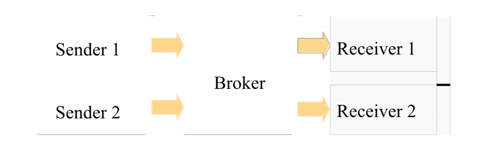

Acomplamiento débil: no existe conexión directa entre senders y receivers

Recomendable: cuando los componentes intercambian mensajes que requieren fuerte transformación de datos

|Atributo de calidad|Ventajas|
|-------------------|--------|
| Disponibilidad | Los Brokers deben estar replicados, usando la misma técnica de publisher - subscriber. |
| Manejo de fallas | Como los brokers tienen puertos de entrada tipificados, validan y descartan mensajes enviados con formato incorrecto. |
| Flexibilidad | Alta. Como la transformación y e l ruteo están separadas de los senders y receivers, la modificación de la aplicación se facilita. |
| Desempeño | Alto. Soporta miles de mensajes por segundo. Los brokers
pueden convertirse en cuello de botella sobre todo si atienden altos
volúmenes de mensajes y ejecutan transformaciones complejas. |
| Esalabilidad | Alta. Los brokers pueden replicarse en clusters de servidores. |

## ESB - Enterprise Service Book

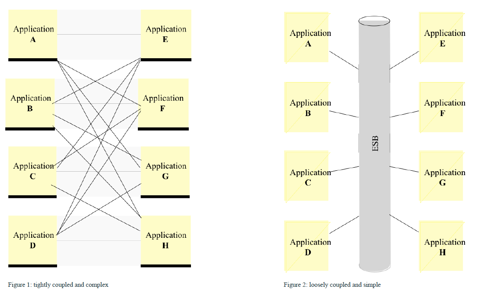

Es un sistema de mensajería empresarial basado en el intercambio de mensajes XML

Los mensajes pueden ser encaminados de forma inteligente a través de una arquitectura distribuída

Es una aplicación de middleware que provee interoperabilidad entre diferentes protocolos de comunicación

Ejemplo:
* una compañía puede recibir mensajes desde protocolos antiguos como FTP
* Un ESB puede tomar los datos desde un servicio FTP, transformarlos en XML y enviarlos a un servicio web para que sean procesados

## ESB principales funcionalidades

Adaptadores de protocolos

Middleware orientado a mensajes

Mensajería basada en XML

Distribución y enrutamiento inteligente

Transfromaciones de mensajes

Tareas y temporizadores

Calidad de servicio

Monitoreo y administración

API extendible

Los ESBs típicamente proveen una multitud de adaptadores como componentes o servicios

Permiten al ESB interactuar fácilmente con los protocolos de comunicación o medios de transporte:
* HTTP, FTP, POP3, SMP, sistema de archivos

Los adaptadores se configuran editando rchivos de configuración en formato XML

# Clase 11 - Pruebas arquitectónicas

## Retos

Requiere expertos para identificar riesgos no predecibles y crisis conocidas

Falta de entendimiendo del diseño de alto nivel
* No hay documentos de las decisiones de diseño arquitectónico
* UML no es lo suficientemente expresivo

Requisitos de calidad no están bien redactados o terminados
* Flexibilidad: pero de qué componente, subsistema, etc.

## Taxonomía de evaluaciones de arquitecturas

## Basada en escenarios

## Diferencias en métodos de evaluación

## Revisiones arquitectónicas

Se usan tecnicas basadas en escenarios

Suelen ser muy costosas para equipos enfocados en productividad
* Releases de tiempo corto
* Plazos apretados
* Poca documentación de desiciones arquitectónicas
* Requisitos con cambios frecuentes
* Equipos pequeños

## Técnicas cuantitativas

Modelos matemáticos basados en++++++++++++++++++++++++++++++++++++++++++

## Técnicas basdas en métricas

Definif métricas que permitan medir el software
* Definir qué se quiere evaluar
* Definir métricas
  * Acoplamiento entre módulos (CBM)
* Planear un diseño de arquitectura real
* Identificar las desviaciones entre la arquitectura deseada y la real
* Formulas cambios

## Ejemplos de métricas

## Basado en herramientas

## Evaluaciones cuando el sistema ya está desarrollado

Conocer el stack

Conocer cómo se tratan los mensajes desde que ============================================

